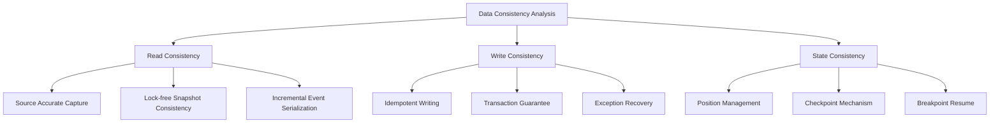
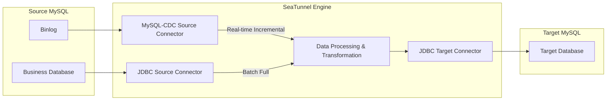
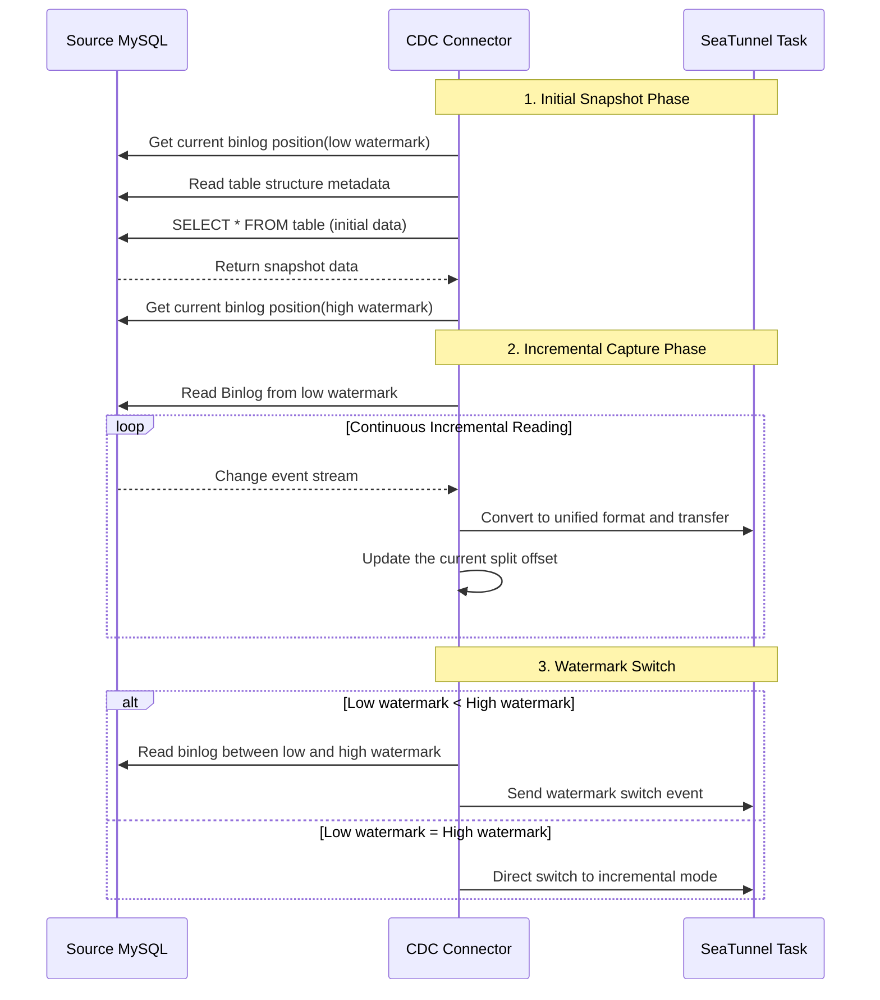
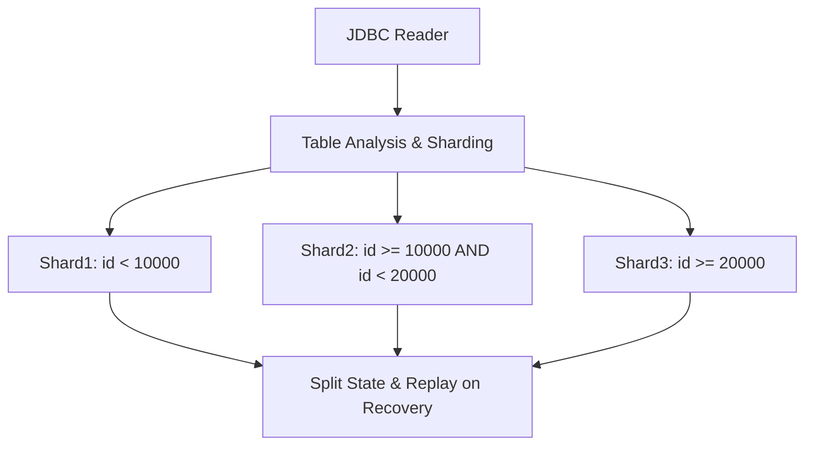
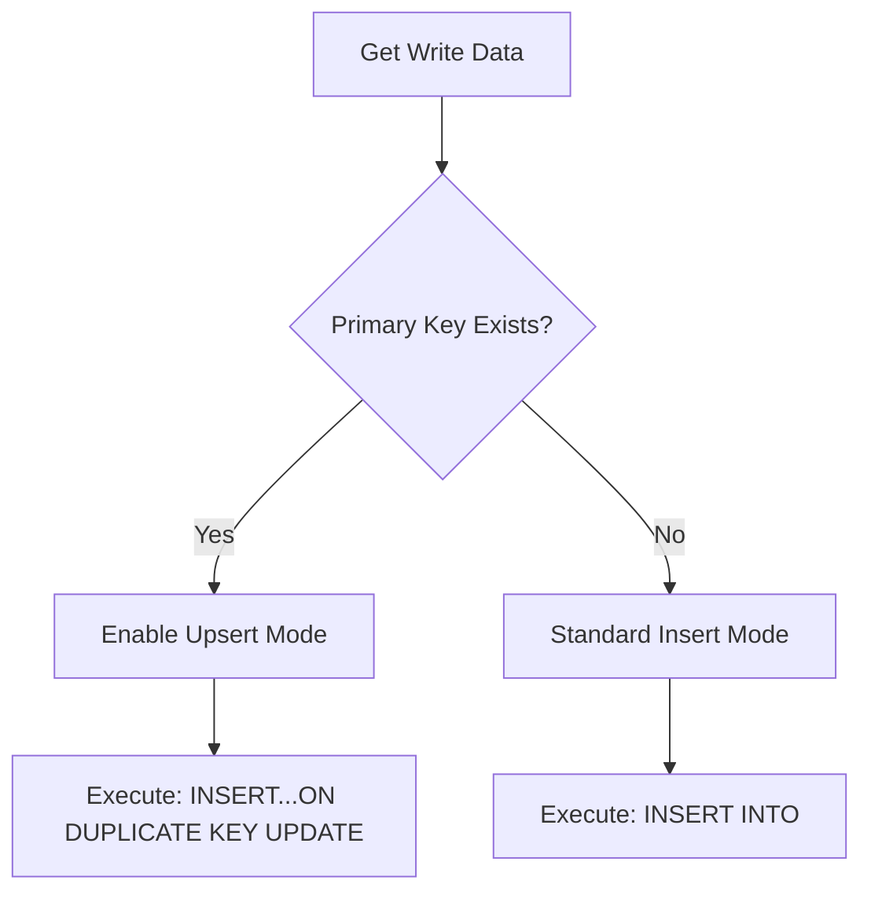
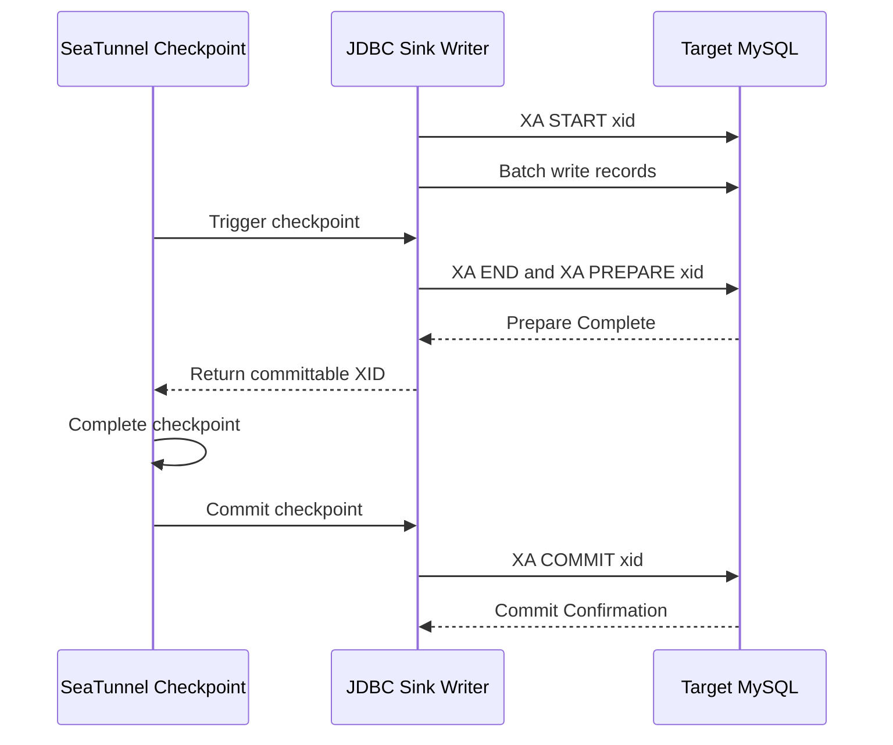
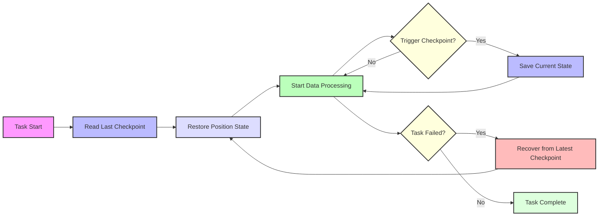
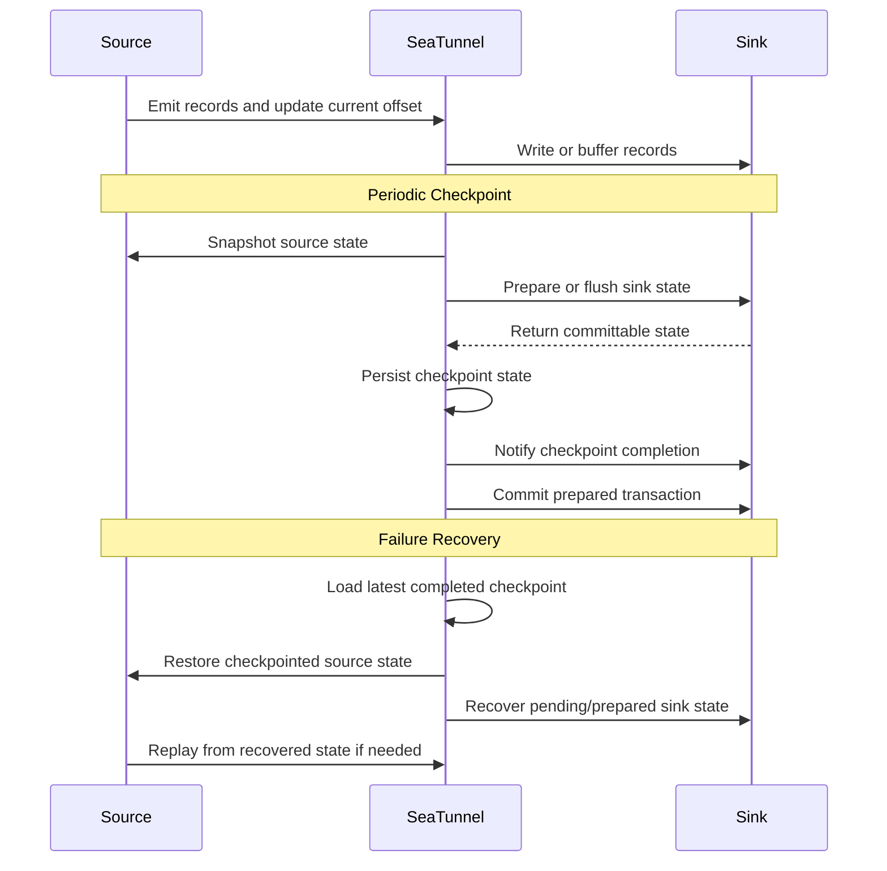

In enterprise-level data integration, **data consistency** is one of the core concerns for technical decision-makers. However, behind this seemingly simple requirement lies complex technical challenges and architectural designs.

When using SeaTunnel for **batch and streaming data synchronization**, enterprise users typically focus on these questions:

> 🔍 "How to ensure data integrity between source and target databases?"
> 🔄 "Can data duplication or loss be avoided after task interruption or recovery?"
> ⚙️ "How to guarantee consistency during full and incremental data synchronization?"

This article uses **Apache SeaTunnel 2.3.13** as its configuration baseline and explains how **Read Consistency, Write Consistency, and State Consistency** work together. "Zero loss" and "zero duplication" are conditional outcomes, not defaults: they require compatible source and sink semantics, successful checkpoints, correct primary or unique keys, and the documented exactly-once settings.

The examples and terminology below follow the versioned documentation for [MySQL-CDC Source](https://seatunnel.apache.org/docs/2.3.13/connectors/source/MySQL-CDC/), [JDBC Source](https://seatunnel.apache.org/docs/2.3.13/connectors/source/Jdbc/), [JDBC Sink](https://seatunnel.apache.org/docs/2.3.13/connectors/sink/Jdbc/), and [job environment configuration](https://seatunnel.apache.org/docs/2.3.13/introduction/configuration/JobEnvConfig/).

## I. Understanding the Three Dimensions of Data Consistency

In data integration, "consistency" is not a single concept but a set of guarantees covering multiple dimensions. For practical analysis, this article groups the relevant SeaTunnel mechanisms into three dimensions:



### Read Consistency

**Read Consistency** ensures that data obtained from the source system maintains logical integrity at a specific point in time or event sequence. This dimension addresses the question of "what data to capture":

- **Full Read**: Obtaining a complete data snapshot at a specific point in time
- **Incremental Capture**: Accurately recording all data change events (CDC mode)
- **Lock-free Snapshot Consistency**: When `exactly_once = true`, using low and high watermarks to reconcile changes that occur during a snapshot

### Write Consistency

**Write Consistency** ensures data is reliably and correctly written to the target system, addressing "how to write safely":

- **Idempotent Writing**: Replaying the same key updates one target record when a stable primary/unique key and upsert semantics are available
- **Transaction Integrity**: Committing the records handled by a sink writer in a checkpoint-aligned transaction when the sink supports it
- **Error Handling**: Recovering from a completed checkpoint, with replay behavior determined by the source and sink

### State Consistency

**State Consistency** is the bridge connecting read and write ends, ensuring state tracking and recovery throughout the data synchronization process:

- **Position Management**: Recording read progress for precise incremental synchronization
- **Checkpoint Mechanism**: Periodically saving task state
- **Checkpoint Recovery**: Restoring a completed checkpoint; records after that checkpoint may be replayed unless the sink is idempotent or transactionally exactly-once

## II. MySQL Synchronization Architecture: CDC vs. JDBC Mode Comparison

SeaTunnel provides two mainstream MySQL data synchronization modes: **JDBC Batch Mode** and **CDC Real-time Capture Mode**. They serve different workloads and have different recovery and delivery characteristics.



### CDC Mode: Low-latency Binlog Change Capture

The MySQL-CDC connector uses an embedded Debezium framework to read and parse MySQL's binlog change stream:

**Core Advantages**:

- **Low Latency**: Reads binlog changes continuously; observed latency depends on source load, network, and job resources
- **Reduced Polling**: Avoids repeated table polling, while the initial snapshot still consumes source resources
- **Completeness**: Captures complete events for INSERT/UPDATE/DELETE
- **Change Metadata**: Emits row-level change events with binlog position metadata

**Recovery and Ordering Characteristics**:

- Checkpointed binlog filename and position for recovery
- Supports multiple startup modes (Initial snapshot + incremental / Incremental only)
- Preserves the order observed by a source reader; end-to-end ordering still depends on table routing, parallelism, and downstream processing

MySQL-CDC does not turn one source transaction into one atomic downstream transaction. It emits individual row change events, while checkpoint and sink semantics determine the delivery guarantee.

### JDBC Mode: SQL-based Batch Synchronization Solution

The JDBC connector reads data from MySQL through SQL queries, suitable for periodic full synchronization or low-frequency change scenarios:

**Core Advantages**:

- **Simple Development**: Based on standard SQL, flexible configuration
- **Full Synchronization**: Suitable for initializing large amounts of data
- **Filtering Capability**: Supports complex WHERE condition filtering
- **Parallel Loading**: Multi-shard parallel reading based on primary key or range

**Recovery Characteristics**:

- Tracks JDBC splits, not a row offset inside an in-flight split
- Reassigns or replays unfinished splits after failure
- Table-level parallel processing

Therefore, JDBC Source recovery is split-level. A failed in-flight split can be read again from its boundary, so duplicate prevention must be provided by an idempotent or transactionally exactly-once sink.

## III. Read Consistency: How to Ensure Complete Source Data Capture

### CDC Mode: Binlog-based Precise Incremental Reading

The MySQL-CDC connector's read consistency is based on two core mechanisms: **Initial Snapshot** and **Binlog Position Tracking**.



**Startup Modes and Consistency Guarantee**:

SeaTunnel's MySQL-CDC provides multiple startup modes to meet consistency requirements for different scenarios:

1. **Initial Mode**: Creates a full snapshot and then continues with incremental binlog reading. Set `exactly_once = true` when the snapshot must backfill changes between its low and high watermarks.

   ```hocon
   MySQL-CDC {
     startup.mode = "initial"
     exactly_once = true
   }
   ```

2. **Latest Mode**: Only captures the latest changes after connector startup

   ```hocon
   MySQL-CDC {
     startup.mode = "latest"
   }
   ```

3. **Specific Mode**: Starts synchronization from specified binlog position

   ```hocon
   MySQL-CDC {
     startup.mode = "specific"
     startup.specific-offset.file = "mysql-bin.000003"
     startup.specific-offset.pos = 4571
   }
   ```

There is also an `earliest` startup mode, which starts from the earliest available offset.

### JDBC Mode: Shard-based Efficient Batch Reading

The JDBC connector supports parallel reading through a configurable sharding strategy:



**Sharding Strategy and Consistency**:

- **Primary/Unique Key Sharding**: Splits a table by a supported key when one is available
- **Configured Partition Column**: Uses `partition_column` when automatic key discovery is not suitable
- **Even or Sampled Splitting**: Selects a split strategy according to the key distribution and configured thresholds

Example configuration for SeaTunnel JDBC reading shards:

```hocon
Jdbc {
  url = "jdbc:mysql://source_mysql:3306/test"
  driver = "com.mysql.cj.jdbc.Driver"
  user = "root"
  password = "password"
  table_path = "test.users"
  split.size = 10000
  split.even-distribution.factor.upper-bound = 100
  split.even-distribution.factor.lower-bound = 0.05
  split.sample-sharding.threshold = 1000
}
```

Through this approach, SeaTunnel achieves:

- Parallel processing of independent splits
- Checkpoint tracking of pending split state
- Replay of an unfinished split from its split boundary after recovery

This is not row-level breakpoint resume. If replay could reach the target twice, use target primary/unique keys with idempotent upsert or enable a supported exactly-once sink.

## IV. Write Consistency: How to Ensure Target Data Accuracy

In the data writing phase, SeaTunnel provides configurable mechanisms for controlling replay and transaction behavior at the target MySQL database.

### Idempotent Writing: Ensuring No Data Duplication

SeaTunnel's JDBC Sink connector implements idempotent writing through multiple strategies:

**Upsert Mode**:



Example configuration for idempotent writing:

```hocon
Jdbc {
  url = "jdbc:mysql://target_mysql:3306/test"
  driver = "com.mysql.cj.jdbc.Driver"
  user = "root"
  password = "password"
  generate_sink_sql = true
  database = "test"
  table = "users"
  primary_keys = ["id"]
  enable_upsert = true
}
```

**Batch Commit and Optimization**:

JDBC Sink uses explicit, fixed configuration for batching and retries:

- **Fixed Batch Size**: `batch_size` controls how many buffered records trigger a flush
- **Checkpoint-aligned Flush**: Buffered records are also flushed as part of checkpoint processing
- **Configured Retries**: `max_retries` controls batch execution retries and defaults to `0`; it must remain `0` when XA exactly-once is enabled

### Distributed Transaction: XA Guarantee and Two-Phase Commit

For connector paths that support it, JDBC Sink coordinates per-writer XA transactions with SeaTunnel checkpoints:



Example configuration for enabling XA distributed transactions:

```hocon
Jdbc {
  url = "jdbc:mysql://target_mysql:3306/test"
  driver = "com.mysql.cj.jdbc.Driver"
  user = "root"
  password = "password"
  generate_sink_sql = true
  database = "test"
  table = "users"
  primary_keys = ["id"]
  enable_upsert = true
  max_retries = 0
  is_exactly_once = true
  xa_data_source_class_name = "com.mysql.cj.jdbc.MysqlXADataSource"
  max_commit_attempts = 3
}
```

**XA Transaction Scope**:

- Each sink writer prepares its XA transaction for a checkpoint
- The prepared transaction is committed after the checkpoint completes
- Recovery handles the writer's pending/prepared transaction according to the connector protocol

This provides checkpoint-aligned exactly-once delivery for each supported JDBC sink writer. It does **not** preserve a source transaction as one downstream transaction, and it is not a single global atomic transaction across multiple tables, writers, or databases. Cross-system business atomicity requires a separate transaction design.

## V. State Consistency: Breakpoint Resume and Failure Recovery

Checkpoint-based state management provides a recovery boundary for supported source and sink connectors.

### Distributed Checkpoint Mechanism

In distributed execution, checkpoints coordinate recoverable task state:



**Core Implementation Principles**:

1. **Position Recording**: Records a CDC split offset; JDBC Source records split state but not a row offset inside an in-flight split
2. **Checkpoint Trigger**: Periodically schedules checkpoints according to `checkpoint.interval`
3. **State Persistence**: Persists state information to storage system
4. **Failure Recovery**: Restores the latest completed checkpoint; work after that checkpoint can be replayed

### Conditional End-to-End Delivery Semantics

SeaTunnel coordinates Source and Sink states through checkpoints. The resulting delivery guarantee depends on both connectors and their configuration:



With an at-least-once sink, replay can produce duplicate writes. Idempotent upsert can absorb duplicates when a stable primary/unique key exists. JDBC XA exactly-once additionally requires `is_exactly_once = true`, a compatible XA data source, `max_retries = 0`, checkpointing, and database support.

**Checkpoint Configuration Example**:

```hocon
env {
  checkpoint.interval = 5000
  checkpoint.timeout = 60000
}
```

## VI. Practical Configuration: MySQL CDC to MySQL Full + Incremental Sync

Let's demonstrate how to configure SeaTunnel for reliable MySQL to MySQL data synchronization through a practical example.

### Classic CDC Mode Configuration

The following SeaTunnel 2.3.13 example enables MySQL-CDC snapshot consistency and checkpoint-aligned JDBC XA delivery. The guarantee is conditional on stable source/target primary keys, an XA-capable MySQL driver and server, durable checkpoint storage, and successful checkpoint completion. It is not a global transaction across the two target tables.

```hocon
env {
  job.mode = "STREAMING"
  parallelism = 3
  checkpoint.interval = 60000
  checkpoint.timeout = 120000
}

source {
  MySQL-CDC {
    url = "jdbc:mysql://source_mysql:3306/test_db"
    username = "root"
    password = "password"
    database-names = [
      "test_db"
    ]
    table-names = [
      "test_db.mysqlcdc_to_mysql_table1",
      "test_db.mysqlcdc_to_mysql_table2"
    ]
    server-id = "5400-5408"

    # Initialization mode (full + incremental)
    startup.mode = "initial"
    exactly_once = true

    # Enable DDL changes
    schema-changes.enabled = true

    # Parallel read configuration
    snapshot.split.size = 8096
    snapshot.fetch.size = 1024
  }
}

transform {
  # Optional data transformation processing
}

sink {
  Jdbc {
    url = "jdbc:mysql://mysql_target:3306/test_db?useUnicode=true&characterEncoding=UTF-8&rewriteBatchedStatements=true"
    driver = "com.mysql.cj.jdbc.Driver"
    user = "root"
    password = "password"
    generate_sink_sql = true
    database = "${database_name}"
    table = "${table_name}"
    primary_keys = ["${primary_key}"]
    schema_save_mode = "CREATE_SCHEMA_WHEN_NOT_EXIST"
    data_save_mode = "APPEND_DATA"
    enable_upsert = true
    max_retries = 0
    is_exactly_once = true
    xa_data_source_class_name = "com.mysql.cj.jdbc.MysqlXADataSource"
  }
}
```

Before production use, verify that `${primary_key}` resolves for every routed table and that the target has matching primary or unique keys. If those prerequisites are not available, describe the job as at-least-once rather than zero-duplication.

## VII. Consistency Validation and Monitoring

After deployment, consistency must be validated independently. Record a logical cut such as a source binlog position, wait for the target to reach it, and compare fixed snapshots or use a quiesced window. Comparing a changing source with a lagging target does not prove inconsistency or consistency.

### Data Consistency Validation Methods

1. **Count Comparison**: Compare record counts for the same primary-key range and the same consistency window

   ```sql
   -- Source database
   SELECT COUNT(*) FROM source_db.users;

   -- Target database
   SELECT COUNT(*) FROM target_db.users;
   ```

2. **Deterministic Range Digest**: Read canonical rows in primary-key order for a bounded range and compute a strong digest such as SHA-256 in a reconciliation process

   ```sql
   SELECT id, name, updated_at
   FROM users
   WHERE id >= ? AND id < ?
   ORDER BY id;
   ```

   Serialize every field with an explicit NULL marker and unambiguous length/escaping rules before hashing. Compare both the row count and digest for each range. Avoid `SUM(CRC32(CONCAT_WS(...)))`: CRC32 collisions and NULL handling can hide differences.

3. **Primary-key Drill-down**: When a range differs, compare individual rows by primary key. Random sampling is useful for diagnosis but is not proof of full consistency.

### Consistency Monitoring Metrics

During SeaTunnel task execution, monitor actual connector and checkpoint signals:

- **`CDCRecordFetchDelay`**: Delay observed while fetching CDC records
- **`CDCRecordEmitDelay`**: Delay observed while emitting CDC records
- **Checkpoint Status**: Completion, timeout, and failure signals from the engine
- **External Reconciliation Results**: Count, digest, and row-level differences produced by a separate validation job or data-quality platform

"Write success rate" and "data deviation rate" are not built-in SeaTunnel consistency proofs. Define them in the external monitoring system with an explicit time window and denominator.

## VIII. Best Practices and Performance Optimization

The following recommendations follow the SeaTunnel 2.3.13 connector contracts. Benchmark them with representative data and failure scenarios before production rollout.

### Consistency Scenario Configuration Recommendations

1. **High Reliability Scenario** (e.g., core business data):

   - Enable MySQL-CDC `exactly_once` and periodic checkpoints
   - Use JDBC XA only with a compatible driver/database and keep `max_retries = 0`
   - Configure stable target primary/unique keys and idempotent upsert
   - Store checkpoints durably and test restart, timeout, and prepared-transaction recovery

2. **High Performance Scenario** (e.g., analytical applications):

   - Use CDC mode + batch writing
   - Disable XA only when at-least-once delivery or idempotent replay is acceptable
   - Increase batch size
   - Optimize parallelism settings

3. **Large-scale Initialization Scenario**:

   - Prefer MySQL-CDC `initial` mode when one job must cover snapshot and incremental changes
   - Use JDBC initialization only with a coordinated cutover that records the corresponding binlog position
   - Configure appropriate shard size
   - Adjust parallelism to match server resources
   - Do not switch from JDBC to CDC ad hoc; an uncoordinated cutover can create a gap or overlap

### Common Issues and Solutions

1. **Unstable Network Environment**:

   - Tune connection timeout and job-level recovery settings
   - Keep JDBC Sink `max_retries = 0` when XA exactly-once is enabled
   - Rely on completed checkpoints and verify replay behavior
   - Consider using smaller batch sizes

2. **High Concurrency Write Scenario**:

   - Tune job parallelism against the target database's connection and write capacity
   - Consider table partitioning or larger batches after measuring lock and transaction pressure

3. **Resource-constrained Environment**:

   - Reduce parallelism
   - Increase checkpoint interval only after accepting the larger recovery/replay window
   - Optimize JVM memory configuration

## IX. Conclusion: SeaTunnel's Path to Consistency Guarantee

SeaTunnel provides the building blocks for reliable batch and streaming synchronization, but the final guarantee is a property of the complete job configuration and external systems. Source offsets, completed checkpoints, idempotent keys, and sink transactions must be evaluated together.

SeaTunnel's consistency guarantee philosophy can be summarized as:

1. **Source Recovery State**: CDC offsets or JDBC split state define where recovery resumes
2. **Checkpoint Coordination**: Completed checkpoints align recoverable source and sink state
3. **Explicit Sink Semantics**: Idempotent upsert or supported XA determines how replay is handled
4. **Independent Verification**: Consistent-window reconciliation validates the result

With these prerequisites in place, SeaTunnel can provide zero-loss and zero-duplication delivery for supported connector paths. It does not automatically provide cross-table or cross-database atomicity, and achievable scale and latency must be established by workload-specific testing.

---

> If you have more questions about SeaTunnel's data consistency mechanism, welcome to join the community.
