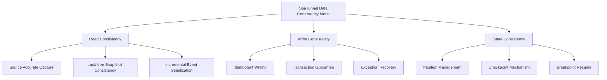
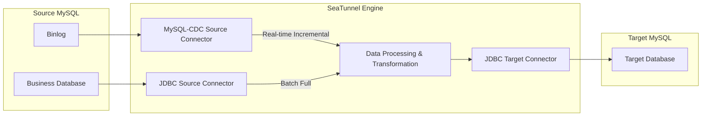
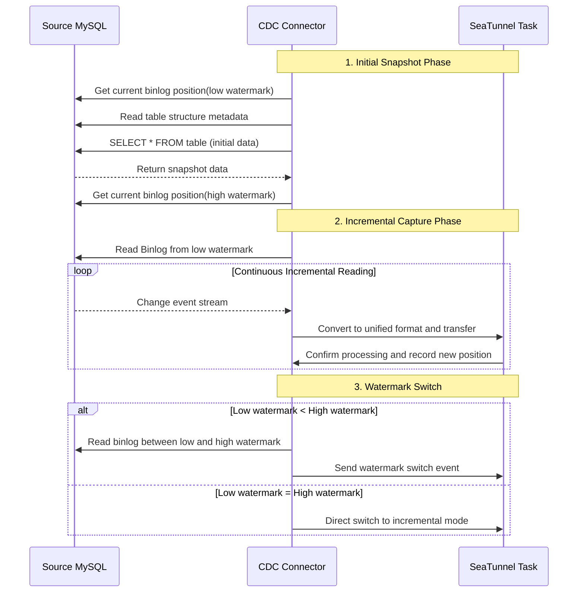
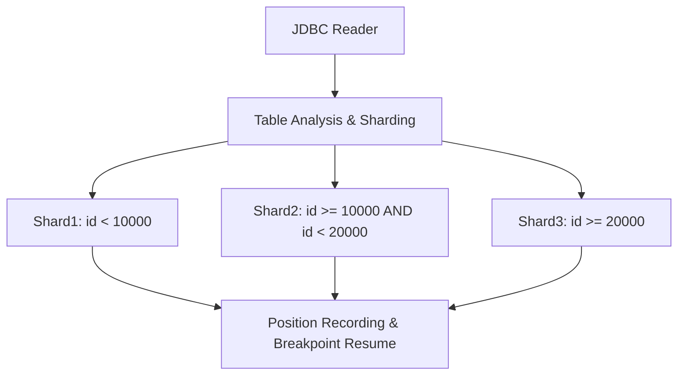
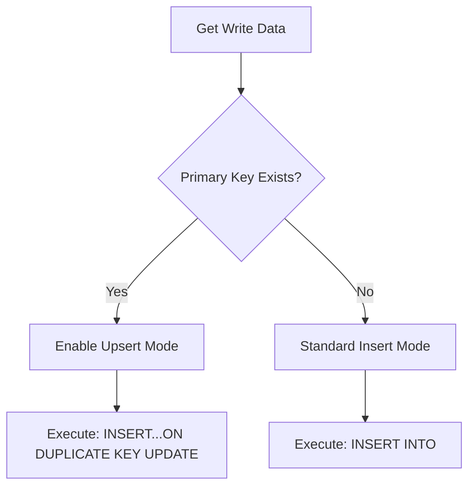
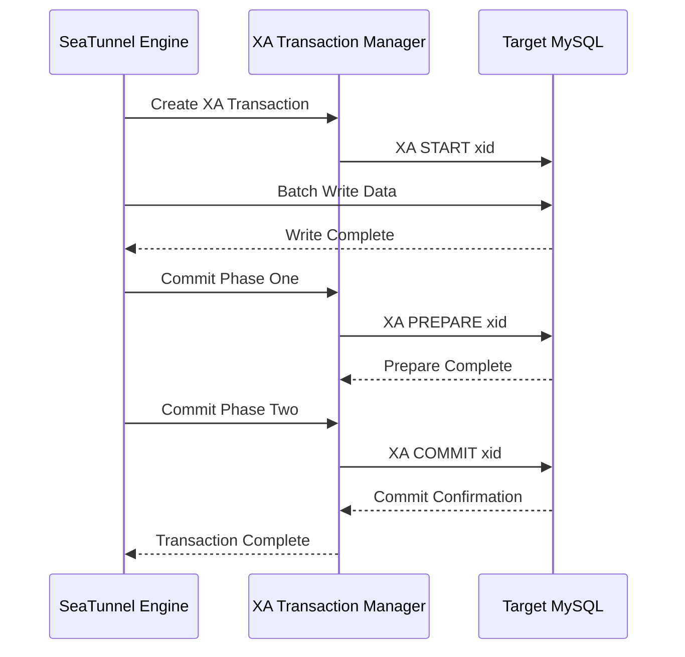
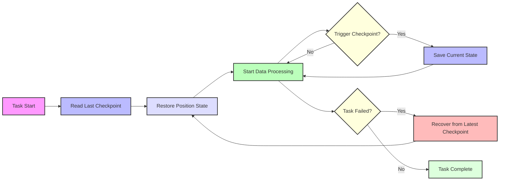
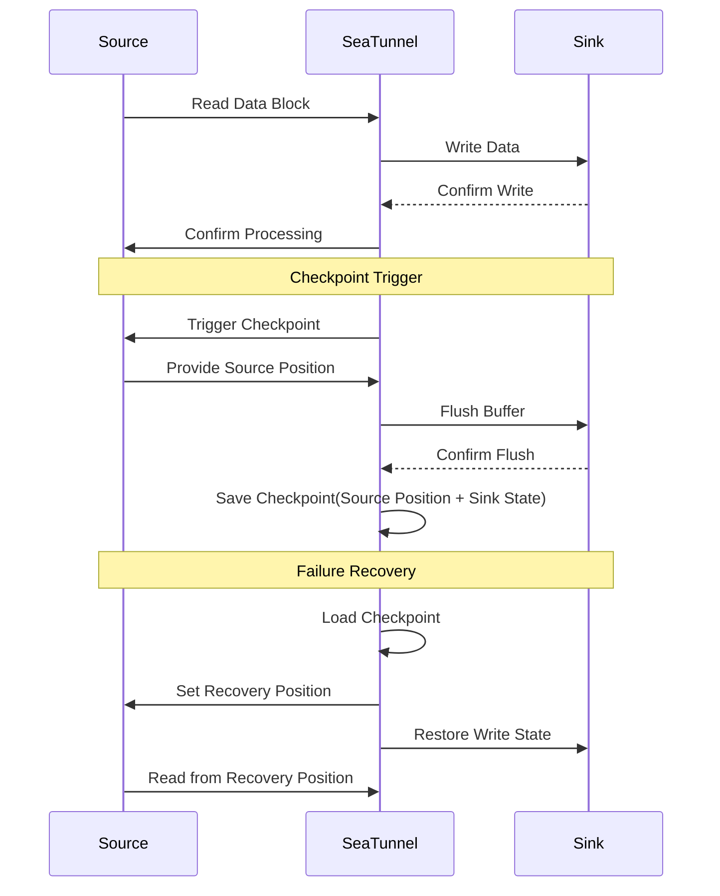

In enterprise-level data integration, **data consistency** is one of the core concerns for technical decision-makers. However, behind this seemingly simple requirement lies complex technical challenges and architectural designs.

When using SeaTunnel for **batch and streaming data synchronization**, enterprise users typically focus on these questions:

> 🔍 "How to ensure data integrity between source and target databases?"
> 🔄 "Can data duplication or loss be avoided after task interruption or recovery?"
> ⚙️ "How to guarantee consistency during full and incremental data synchronization?"

Based on the latest version of SeaTunnel, this article will analyze in detail how SeaTunnel achieves end-to-end consistency guarantee through its advanced three-dimensional architecture of **Read Consistency, Write Consistency, and State Consistency**.

## I. Understanding the Three Dimensions of Data Consistency

In data integration, "consistency" is not a single concept but a systematic guarantee covering multiple dimensions. Based on years of practical experience, SeaTunnel breaks down data consistency into three key dimensions:



### Read Consistency

**Read Consistency** ensures that data obtained from the source system maintains logical integrity at a specific point in time or event sequence. This dimension addresses the question of "what data to capture":

- **Full Read**: Obtaining a complete data snapshot at a specific point in time
- **Incremental Capture**: Accurately recording all data change events (CDC mode)
- **Lock-free Snapshot Consistency**: Ensuring data continuity between full snapshot and incremental changes through low and high watermark mechanisms

### Write Consistency

**Write Consistency** ensures data is reliably and correctly written to the target system, addressing "how to write safely":

- **Idempotent Writing**: Multiple writes of the same data won't produce duplicate records
- **Transaction Integrity**: Ensuring related data is written atomically as a whole
- **Error Handling**: Ability to rollback or safely retry in exceptional cases

### State Consistency

**State Consistency** is the bridge connecting read and write ends, ensuring state tracking and recovery throughout the data synchronization process:

- **Position Management**: Recording read progress for precise incremental synchronization
- **Checkpoint Mechanism**: Periodically saving task state
- **Breakpoint Resume**: Ability to recover from the last interruption point without data loss or duplication

## II. MySQL Synchronization Architecture: CDC vs. JDBC Mode Comparison

SeaTunnel provides two mainstream MySQL data synchronization modes: **JDBC Batch Mode** and **CDC Real-time Capture Mode**. These two modes are suitable for different business scenarios and have their own characteristics in consistency guarantee.



### CDC Mode: Binlog-based High Real-time Solution

The MySQL-CDC connector is based on embedded Debezium framework, directly reading and parsing MySQL's binlog change stream:

**Core Advantages**:

- **Real-time**: Millisecond-level delay in capturing data changes
- **Low Impact**: Almost zero performance impact on source database
- **Completeness**: Captures complete events for INSERT/UPDATE/DELETE
- **Transaction Boundaries**: Preserves original transaction context

**Consistency Guarantee**:

- Precise recording of binlog filename + position
- Supports multiple startup modes (Initial snapshot + incremental / Incremental only)
- Event order strictly consistent with source database

### JDBC Mode: SQL-based Batch Synchronization Solution

The JDBC connector reads data from MySQL through SQL queries, suitable for periodic full synchronization or low-frequency change scenarios:

**Core Advantages**:

- **Simple Development**: Based on standard SQL, flexible configuration
- **Full Synchronization**: Suitable for initializing large amounts of data
- **Filtering Capability**: Supports complex WHERE condition filtering
- **Parallel Loading**: Multi-shard parallel reading based on primary key or range

**Consistency Guarantee**:

- Records synchronization progress of Split + position
- Supports breakpoint resume
- Table-level parallel processing

## III. Read Consistency: How to Ensure Complete Source Data Capture

### CDC Mode: Binlog-based Precise Incremental Reading

MySQL-CDC connector's read consistency is based on two core mechanisms: **Initial Snapshot** and **Binlog Position Tracking**.



**Startup Modes and Consistency Guarantee**:

SeaTunnel's MySQL-CDC provides multiple startup modes to meet consistency requirements for different scenarios:

1. **Initial Mode**: First creates full snapshot, then seamlessly switches to incremental mode

   ```hocon
   MySQL-CDC {
     startup.mode = "initial"
   }
   ```

2. **Latest Mode**: Only captures the latest changes after connector startup

   ```hocon
   MySQL-CDC {
     startup.mode = "latest"
   }
   ```

3. **Specific Mode**: Starts synchronization from specified binlog position

   ```hocon
   MySQL-CDC {
     startup.mode = "specific"
     startup.specific.offset.file = "mysql-bin.000003"
     startup.specific.offset.pos = 4571
   }
   ```

There's also an `earliest` startup mode: starts from the earliest offset found, though this mode is less common

### JDBC Mode: Shard-based Efficient Batch Reading

JDBC connector achieves efficient parallel reading through smart sharding strategy:



**Sharding Strategy and Consistency**:

- **Primary Key Sharding**: Automatically splits into multiple parallel tasks based on primary key range
- **Range Sharding**: Supports custom numeric columns as sharding basis
- **Modulo Sharding**: Suitable for balanced reading of hash-distributed data

Example configuration for SeaTunnel JDBC reading shards:

```hocon
Jdbc {
  url = "jdbc:mysql://source_mysql:3306/test"
  table = "users"
  split.size = 10000
  split.even-distribution.factor.upper-bound = 100
  split.even-distribution.factor.lower-bound = 0.05
  split.sample-sharding.threshold = 1000
}
```

Through this approach, SeaTunnel achieves:

- Maximum parallelism for data reading
- Position recording for each shard
- Precise recovery of failed tasks

## IV. Write Consistency: How to Ensure Target Data Accuracy

In the data writing phase, SeaTunnel provides multiple guarantee mechanisms to ensure consistency and completeness of target MySQL data.

### Idempotent Writing: Ensuring No Data Duplication

SeaTunnel's JDBC Sink connector implements idempotent writing through multiple strategies:

**Upsert Mode**:



Example configuration for idempotent writing:

```hocon
Jdbc {
  url = "jdbc:mysql://target_mysql:3306/test"
  table = "users"
  primary_keys = ["id"]
  enable_upsert = true
}
```

**Batch Commit and Optimization**:

SeaTunnel optimizes JDBC Sink's batch processing performance while ensuring transaction safety:

- **Dynamic Batch Size**: Automatically adjusts batch size based on data volume
- **Timeout Control**: Prevents resource occupation from long transactions
- **Retry Mechanism**: Automatic transaction retry during network jitter

### Distributed Transaction: XA Guarantee and Two-Phase Commit

For business scenarios requiring extremely high consistency, SeaTunnel provides distributed transaction support based on XA protocol:



Example configuration for enabling XA distributed transactions:

```hocon
Jdbc {
  url = "jdbc:mysql://target_mysql:3306/test"
  is_exactly_once = true
  xa_data_source_class_name = "com.mysql.cj.jdbc.MysqlXADataSource"
  max_commit_attempts = 3
  transaction_timeout_sec = 300
}
```

**XA Transaction Consistency Guarantee**:

- **Consistency**: Maintains database from one consistent state to another
- **Isolation**: Concurrent transactions don't interfere with each other
- **Durability**: Once committed, changes are permanent

This mechanism is particularly suitable for data synchronization scenarios across multiple tables and databases, ensuring business data relationship consistency.

## V. State Consistency: Breakpoint Resume and Failure Recovery

SeaTunnel's state consistency mechanism is key to ensuring end-to-end data synchronization reliability. Through carefully designed state management and checkpoint mechanisms, it achieves reliable failure recovery capability.

### Distributed Checkpoint Mechanism

SeaTunnel implements state consistency checkpoints in distributed environments:



**Core Implementation Principles**:

1. **Position Recording**: Records binlog filename and position in CDC mode, records shard and offset in JDBC mode
2. **Checkpoint Trigger**: Triggers checkpoint creation based on time or data volume
3. **State Persistence**: Persists state information to storage system
4. **Failure Recovery**: Automatically loads most recent valid checkpoint on task restart

### End-to-End Consistency Guarantee

SeaTunnel achieves end-to-end consistency guarantee by coordinating Source and Sink states:



**Checkpoint Configuration Example**:

```hocon
env {
  checkpoint.interval = 5000
  checkpoint.timeout = 60000
}
```

## VI. Practical Configuration: MySQL CDC to MySQL Full + Incremental Sync

Let's demonstrate how to configure SeaTunnel for reliable MySQL to MySQL data synchronization through a practical example.

### Classic CDC Mode Configuration

The following configuration implements a MySQL CDC to MySQL synchronization task with complete consistency guarantee:

```hocon
env {
  job.mode = "STREAMING"
  parallelism = 3
  checkpoint.interval = 60000
}

source {
  MySQL-CDC {
    base-url="jdbc:mysql://xxx:3306/qa_source"
    username = "xxxx"
    password = "xxxxxx"
    database-names=[
        "test_db"
    ]
    table-names=[
        "test_db.mysqlcdc_to_mysql_table1",
        "test_db.mysqlcdc_to_mysql_table2",
     ]

    # Initialization mode (full + incremental)
    startup.mode = "initial"

    # Enable DDL changes
    schema-changes.enabled = true

    # Parallel read configuration
    snapshot.split.size = 8096
    snapshot.fetch.size = 1024
  }
}

transform {
  # Optional data transformation processing
}

sink {
  Jdbc {
    url = "jdbc:mysql://mysql_target:3306/test_db?useUnicode=true&characterEncoding=UTF-8&rewriteBatchedStatements=true"
    driver = "com.mysql.cj.jdbc.Driver"
    user = "root"
    password = "password"
    database = "test_db"
    table = "${table_name}"
    schema_save_mode = "CREATE_SCHEMA_WHEN_NOT_EXIST"
    data_save_mode = "APPEND_DATA"
    # enable_upsert = false
    # support_upsert_by_query_primary_key_exist = true

    # Exactly-once semantics (optional)
    #is_exactly_once = true
    #xa_data_source_class_name = "com.mysql.cj.jdbc.MysqlXADataSource"
  }
}
```

## VII. Consistency Validation and Monitoring

After deploying data synchronization tasks in production environment, validating and monitoring consistency is crucial. SeaTunnel provides multiple methods for data consistency validation and monitoring.

### Data Consistency Validation Methods

1. **Count Comparison**: Most basic validation method, comparing record counts between source and target tables

   ```sql
   -- Source database
   SELECT COUNT(*) FROM source_db.users;

   -- Target database
   SELECT COUNT(*) FROM target_db.users;
   ```

2. **Hash Comparison**: Calculate hash for key fields to compare data content consistency

   ```sql
   -- Source database
   SELECT SUM(CRC32(CONCAT_WS('|', id, name, updated_at))) FROM source_db.users;

   -- Target database
   SELECT SUM(CRC32(CONCAT_WS('|', id, name, updated_at))) FROM target_db.users;
   ```

3. **Sample Comparison**: Randomly sample records from source table and compare with target table

### Consistency Monitoring Metrics

During SeaTunnel task execution, the following key metrics can be monitored to evaluate synchronization consistency status:

- **Synchronization Lag**: Time difference between current time and latest processed record time
- **Write Success Rate**: Proportion of successfully written records to total records
- **Data Deviation Rate**: Difference rate between source and target database data (can be implemented through DolphinScheduler 3.1.x's data quality task)

## VIII. Best Practices and Performance Optimization

Based on deployment experience from hundreds of production environments, we summarize the following best practices for MySQL to MySQL synchronization:

### Consistency Scenario Configuration Recommendations

1. **High Reliability Scenario** (e.g., core business data):

   - Use CDC mode + XA transactions
   - Configure shorter checkpoint intervals
   - Enable idempotent writing
   - Configure reasonable retry strategy

2. **High Performance Scenario** (e.g., analytical applications):

   - Use CDC mode + batch writing
   - Disable XA transactions, use normal transactions
   - Increase batch size
   - Optimize parallelism settings

3. **Large-scale Initialization Scenario**:

   - Use JDBC mode for initialization
   - Configure appropriate shard size
   - Adjust parallelism to match server resources
   - Switch to CDC mode after completion

### Common Issues and Solutions

1. **Unstable Network Environment**:

   - Increase connection timeout and retry counts
   - Enable breakpoint resume
   - Consider using smaller batch sizes

2. **High Concurrency Write Scenario**:

   - Adjust target database connection pool size
   - Consider using table partitioning or batch writing

3. **Resource-constrained Environment**:

   - Reduce parallelism
   - Increase checkpoint interval
   - Optimize JVM memory configuration

## IX. Conclusion: SeaTunnel's Path to Consistency Guarantee

Through its carefully designed three-dimensional consistency architecture, SeaTunnel successfully solves the critical data consistency issues in enterprise-level data synchronization. This design supports both high-throughput batch data processing and ensures precision in real-time incremental synchronization, providing a solid foundation for enterprise data architecture.

SeaTunnel's consistency guarantee philosophy can be summarized as:

1. **End-to-end Consistency**: Full-chain guarantee from data reading to writing
2. **Failure Recovery Capability**: Able to recover and continue synchronization even under extreme conditions
3. **Flexible Consistency Levels**: Choose appropriate consistency strength based on business requirements
4. **Verifiable Consistency**: Verify data integrity through multiple mechanisms

These features make SeaTunnel an ideal choice for building enterprise-level data integration platforms, capable of handling data synchronization challenges from TB to PB scale while ensuring enterprise data integrity and accuracy.

---

> If you have more questions about SeaTunnel's data consistency mechanism, welcome to join the community.
