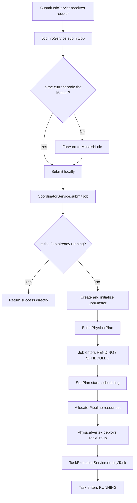
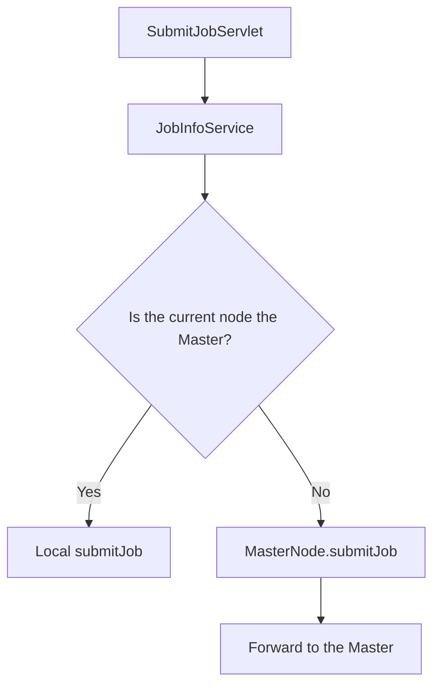
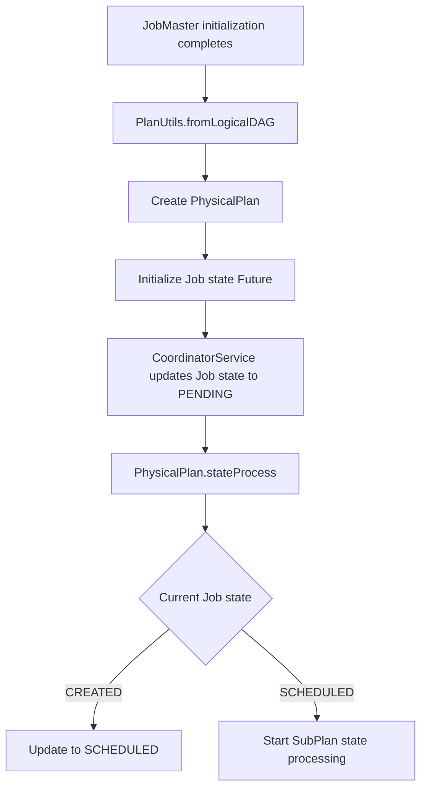
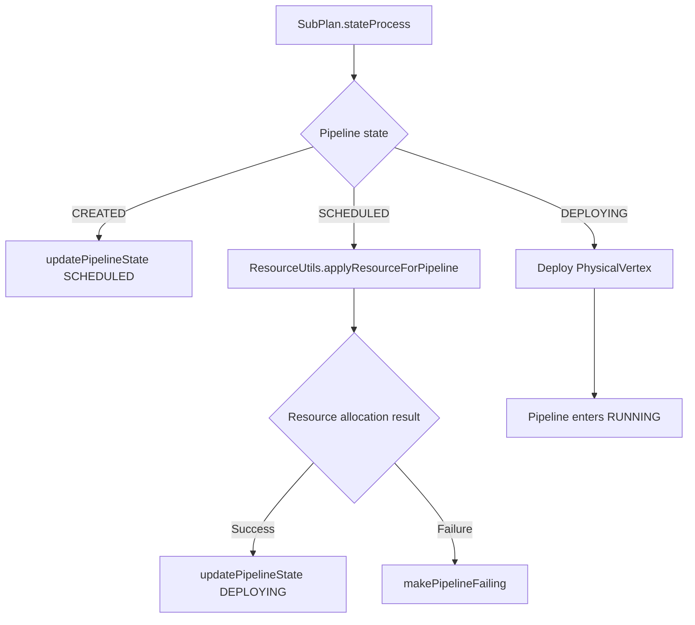
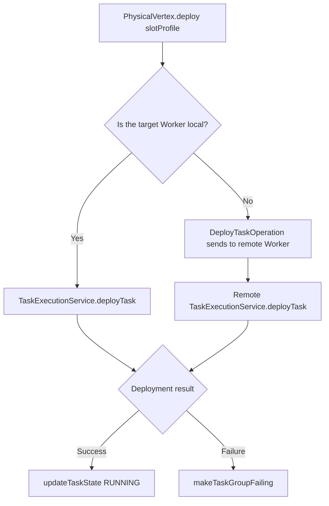
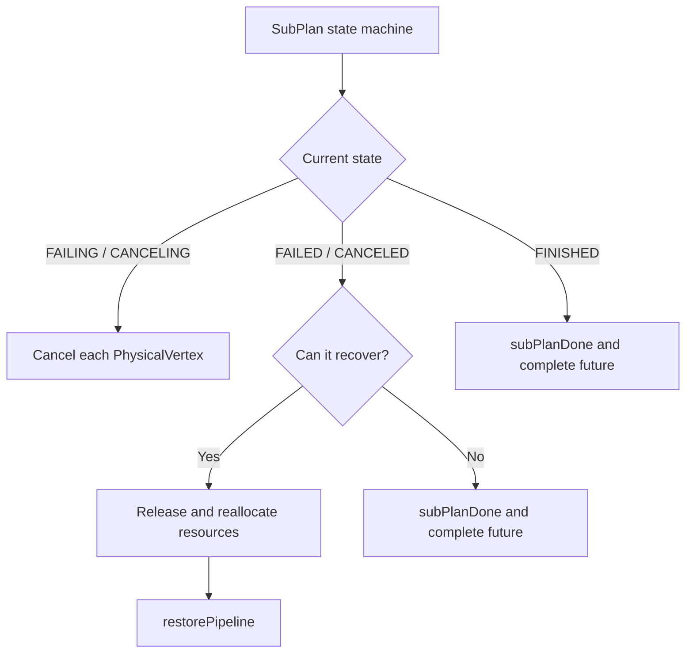
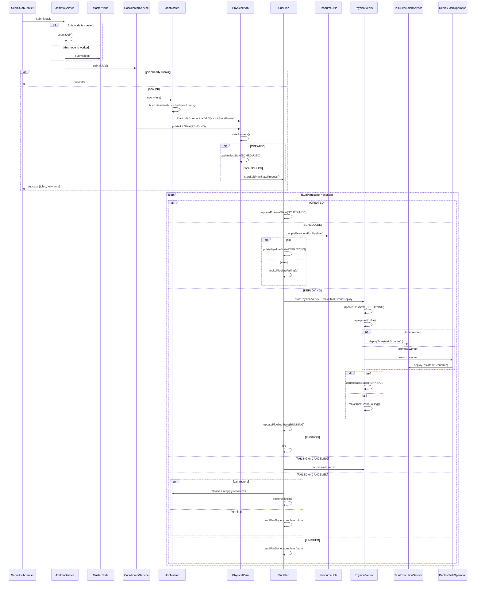

Submitting a SeaTunnel job may look like a simple `submitJob` request. Inside the server, however, it passes through multiple stages: Master detection, job coordination, `JobMaster` initialization, physical execution plan construction, Pipeline resource allocation, and TaskGroup deployment.

Based on the submitJob sequence I organized, this article focuses on one main path: **what happens between a job submission request entering SeaTunnel Server and the final call to `TaskExecutionService.deployTask()` that deploys the TaskGroup.**

This article does not cover the thread model inside `TaskExecutionService`, Task execution details, or data flow. It focuses on the job submission, scheduling, and deployment path.

## Core Components

Before walking through the process, let's look at the responsibilities of the key objects on the submitJob path.

| Component | Responsibility |
| --- | --- |
| `SubmitJobServlet` | Receives external job submission requests and serves as one of the server-side entry points. |
| `JobInfoService` | Handles the job submission entry logic and determines whether the current node is the Master or a Worker. |
| `MasterNode` | Forwards the job submission request to the Master when the current node is not the Master. |
| `CoordinatorService` | Serves as the job coordination entry point, checks whether the job is already running, and creates or manages the `JobMaster`. |
| `JobMaster` | Acts as the runtime control center for a single Job and initializes the runtime context, classloader, checkpoint configuration, and related resources. |
| `PhysicalPlan` | Represents the physical execution plan built from the logical DAG and drives Job-level state transitions. |
| `SubPlan` | Acts as the Pipeline-level scheduling unit and handles resource allocation and Pipeline state transitions. |
| `ResourceUtils` | Allocates runtime resources for a Pipeline. |
| `PhysicalVertex` | Represents a finer-grained physical execution node and deploys TaskGroups. |
| `TaskExecutionService` | Receives and deploys TaskGroups. |

## Overall Process

First, the following simplified flowchart provides an overview of the entire path.



This path can be summarized in one sequence:

```text
SubmitJobServlet
  -> JobInfoService
  -> MasterNode / CoordinatorService
  -> JobMaster
  -> PhysicalPlan
  -> SubPlan
  -> PhysicalVertex
  -> TaskExecutionService
```

Let's examine it stage by stage.

## Stage 1: The Request Enters JobInfoService

The job submission request first enters `SubmitJobServlet` and is then handed to `JobInfoService`.

The key action here is not starting the job immediately. The system first determines: **is the node that received the request the Master?**



If the current node is the Master, `JobInfoService` can continue the submission locally. If the current node is a Worker, it forwards the request to the Master through `MasterNode.submitJob()`.

This design ensures that job submission is coordinated centrally by the Master and prevents multiple nodes from creating independent Job scheduling contexts.

## Stage 2: CoordinatorService Takes Over

After the request reaches the Master, it proceeds to `CoordinatorService.submitJob()`.

`CoordinatorService` mainly performs two tasks here:

1. Determine whether the Job already exists or is running.
2. For a new job, create and initialize the corresponding `JobMaster`.

If the job is already running, SeaTunnel does not need to create another scheduling context and can return a successful submission response directly. A new job enters the `JobMaster` initialization process.

At this point, `submitJob` has moved from API request handling into the scheduling system.

## Stage 3: JobMaster Initialization

`JobMaster` can be understood as the runtime control center for a Job.

After a `JobMaster` is created, it performs the preparation required before execution, including:

- Building the classloader required by the job.
- Initializing checkpoint-related configuration.
- Preparing the context required to construct the physical execution plan from the logical DAG.

No Task is deployed at this stage. It prepares the runtime environment for subsequent scheduling.

## Stage 4: From the Logical DAG to PhysicalPlan

After `JobMaster` initialization, SeaTunnel builds a `PhysicalPlan` from the logical DAG.



One important concept here is that **SeaTunnel does not start the entire job at once. It advances execution step by step through a state machine.**

At the Job level, the core state transition can be simplified as:

```text
CREATED -> SCHEDULED -> startSubPlanStateProcess
```

`PhysicalPlan` drives Job-level state transitions, while actual Pipeline scheduling continues at the `SubPlan` level.

## Stage 5: SubPlan Allocates Resources and Starts Deployment

At the `SubPlan` level, SeaTunnel's scheduling granularity moves from the entire Job down to an individual Pipeline.

`SubPlan.stateProcess()` performs different actions according to the current Pipeline state:



The key points at this level are:

- In the `CREATED` state, the Pipeline first transitions to `SCHEDULED`.
- In the `SCHEDULED` state, it starts allocating resources through `ResourceUtils.applyResourceForPipeline()`.
- After resource allocation succeeds, the Pipeline enters `DEPLOYING`.
- If resource allocation fails, the Pipeline enters `makePipelineFailing(e)`.

Therefore, a Pipeline is not deployed immediately. It must first obtain the resources required to run.

## Stage 6: PhysicalVertex Deploys the TaskGroup

When the Pipeline enters `DEPLOYING`, the `SubPlan` starts the `PhysicalVertex` instances it contains.

`PhysicalVertex` first updates the Task state to `DEPLOYING`, then deploys it according to the allocated `slotProfile`.

Deployment has one important branch: is the target Worker local or remote?



If the target Worker is the current node, SeaTunnel can call the local `TaskExecutionService.deployTask(taskGroupInfo)` directly.

If the target Worker is remote, SeaTunnel sends the deployment request through `DeployTaskOperation`. The request ultimately enters `TaskExecutionService.deployTask(taskGroupInfo)` on the target Worker.

After successful deployment, `PhysicalVertex` updates the Task state to `RUNNING`. If deployment fails, it enters `makeTaskGroupFailing()`.

When the TaskGroups inside the Pipeline have been deployed and entered the running state, the `SubPlan` also transitions to `RUNNING`.

## Failure, Cancellation, and Recovery Branches

In addition to normal submission and deployment, the `SubPlan` state machine handles failure, cancellation, and recovery.

The following diagram provides a simplified view:



This is why the preceding state-machine design matters:

- The normal path can advance deployment and execution.
- The failure path can enter failing and failed states.
- The cancellation path can enter canceling and canceled states.
- If recovery conditions are met, the Pipeline can release its resources, allocate them again, and recover.

In other words, the state machine does not exist merely to make the process more complex. It makes the job lifecycle controllable.

## Complete Sequence Diagram

Finally, the following sequence diagram connects the main process and makes the overall call order easier to follow.



## Summary

The core logic after SeaTunnel receives a job submission is not simply to start the job immediately.

It generally follows this main path:

```text
SubmitJobServlet
  -> JobInfoService
  -> MasterNode / CoordinatorService
  -> JobMaster
  -> PhysicalPlan
  -> SubPlan
  -> PhysicalVertex
  -> TaskExecutionService
```

In this process:

- `JobInfoService` handles the submission entry point and determines whether the request must be forwarded to the Master.
- `CoordinatorService` coordinates the job, prevents duplicate submissions, and creates the `JobMaster`.
- `JobMaster` initializes the Job runtime context.
- `PhysicalPlan` drives Job-level state transitions.
- `SubPlan` handles Pipeline-level resource allocation and scheduling.
- `PhysicalVertex` deploys TaskGroups.
- `TaskExecutionService` is the final entry point for TaskGroup deployment.

After understanding this path, it becomes easier to place SeaTunnel's Task execution thread model, data flow, and checkpoint mechanism in the correct part of the architecture.
