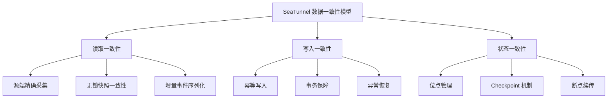
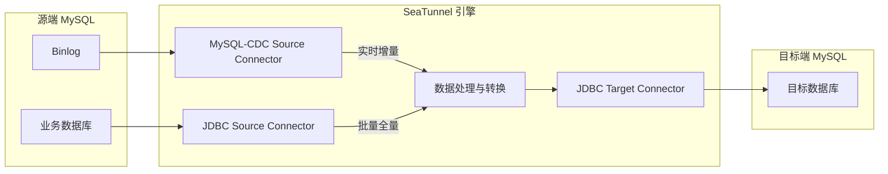
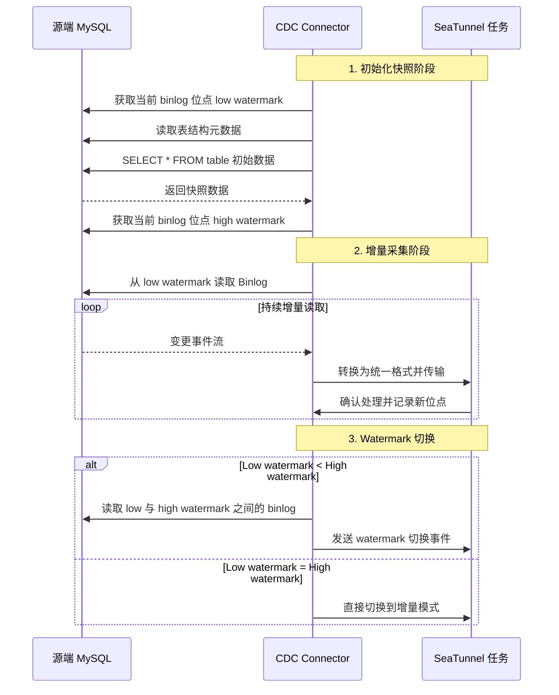
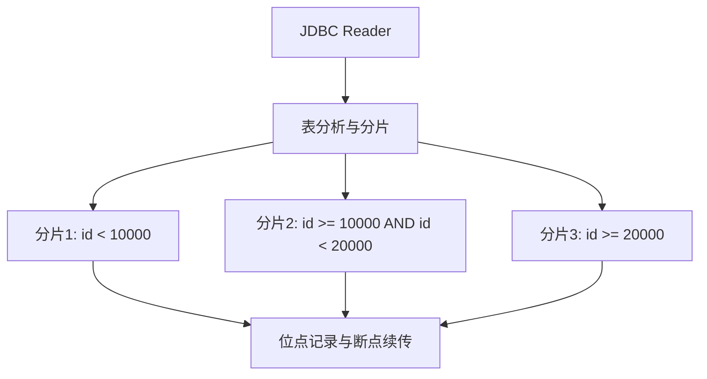
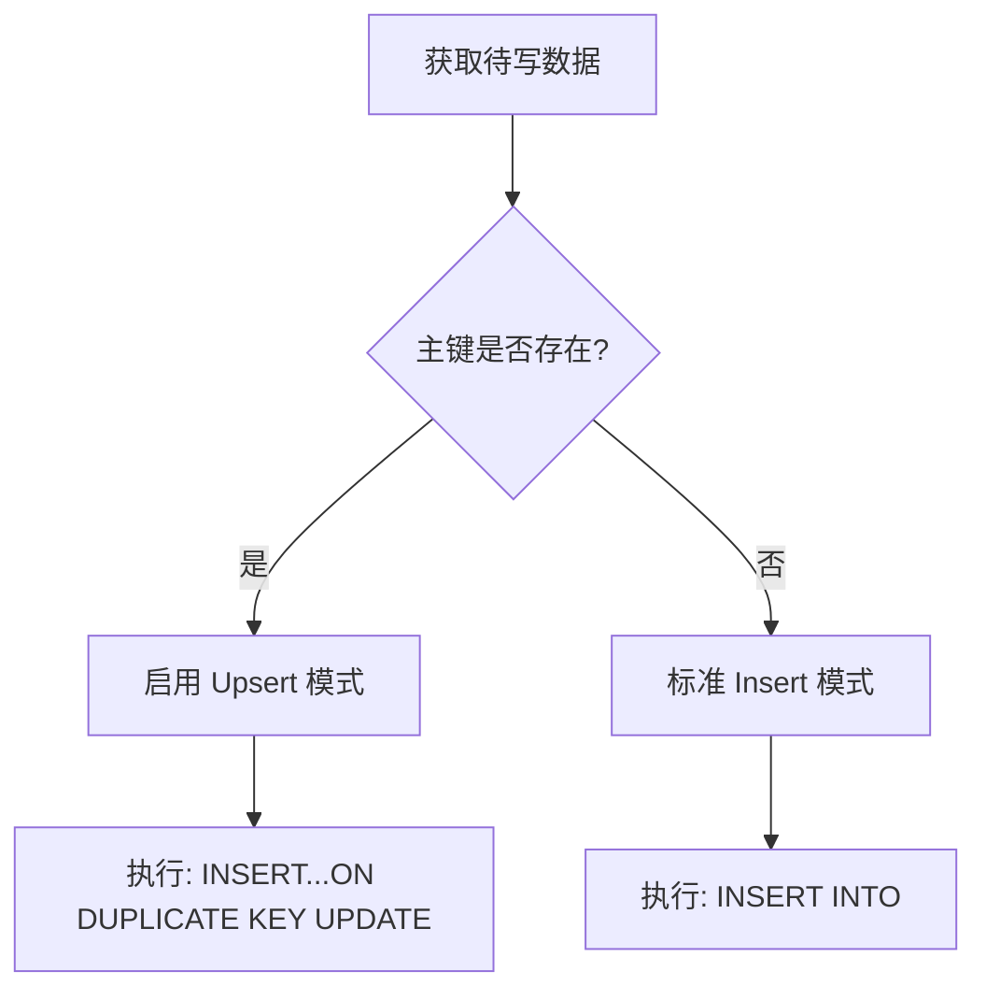
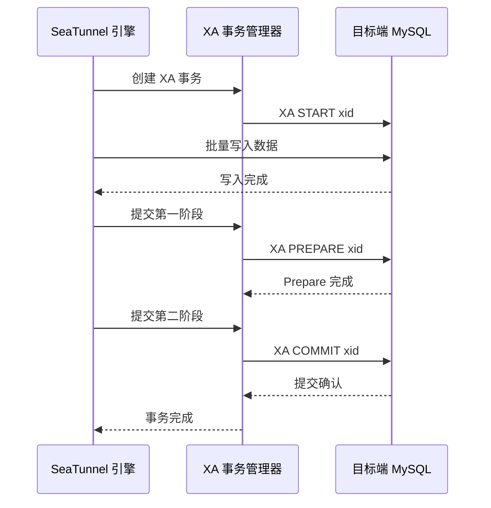
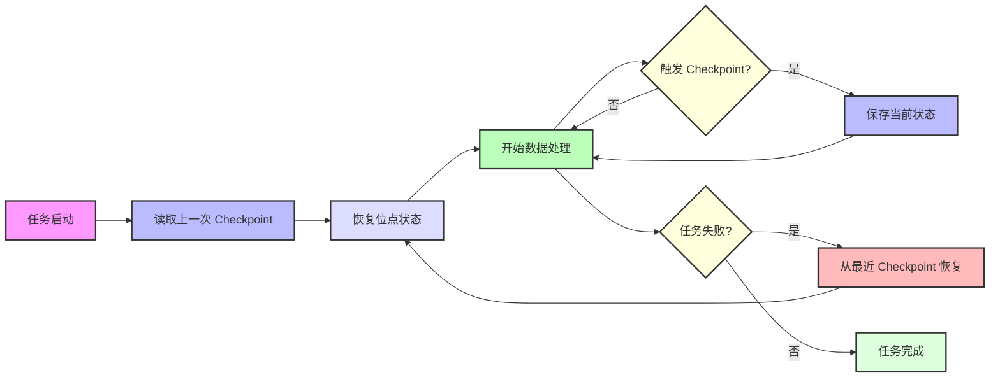
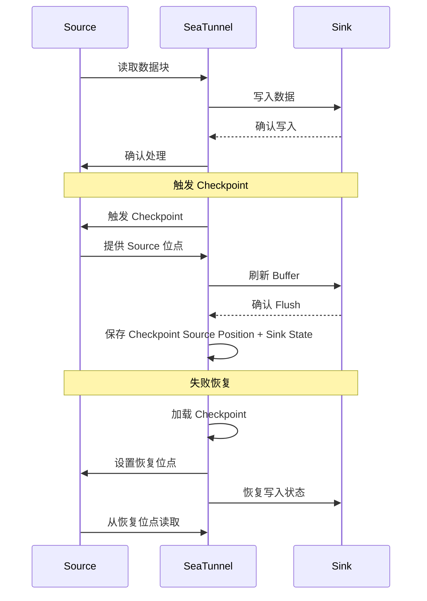

在企业级数据集成中，**数据一致性** 是技术决策者最关心的核心问题之一。但在这个看似简单的诉求背后，实际隐藏着复杂的技术挑战和架构设计。

当企业用户使用 SeaTunnel 进行 **批流数据同步** 时，通常会关注这些问题：

> 🔍 “如何确保源库和目标库之间的数据完整性？”  
> 🔄 “任务中断或恢复后，能否避免数据重复或丢失？”  
> ⚙️ “全量同步与增量同步过程中，如何保证一致性？”

本文基于 SeaTunnel 最新版本，详细分析 SeaTunnel 如何通过 **读取一致性、写入一致性和状态一致性** 这套三维架构，实现端到端的一致性保障。

## 一、理解数据一致性的三个维度

在数据集成领域，“一致性”并不是一个单一概念，而是一套覆盖多个维度的系统性保障。基于多年的实践经验，SeaTunnel 将数据一致性拆解为三个关键维度：



### 读取一致性

**读取一致性** 确保从源端系统获取的数据，在某个时间点或事件序列上保持逻辑完整性。这个维度解决的是“应该采集哪些数据”的问题：

- **全量读取**：在特定时间点获取完整的数据快照
- **增量采集**：准确记录所有数据变更事件（CDC 模式）
- **无锁快照一致性**：通过 low watermark 和 high watermark 机制，保障全量快照与增量变更之间的数据连续性

### 写入一致性

**写入一致性** 确保数据能够可靠、正确地写入目标端系统，解决的是“如何安全写入”的问题：

- **幂等写入**：同一批数据多次写入不会产生重复记录
- **事务完整性**：确保相关数据作为一个整体原子性写入
- **错误处理**：异常场景下具备回滚或安全重试能力

### 状态一致性

**状态一致性** 是连接读取端和写入端的桥梁，确保整个数据同步过程中的状态跟踪与恢复：

- **位点管理**：记录读取进度，用于精确增量同步
- **Checkpoint 机制**：周期性保存任务状态
- **断点续传**：从上次中断位置恢复，避免数据丢失或重复

## 二、MySQL 同步架构：CDC 与 JDBC 模式对比

SeaTunnel 提供两种主流的 MySQL 数据同步模式：**JDBC 批模式** 和 **CDC 实时采集模式**。这两种模式适用于不同业务场景，并且在一致性保障上各有特点。



### CDC 模式：基于 Binlog 的高实时方案

MySQL-CDC Connector 基于嵌入式 Debezium 框架实现，直接读取并解析 MySQL 的 binlog 变更流：

**核心优势**：

- **实时性**：毫秒级捕获数据变更
- **低影响**：对源端数据库几乎没有性能影响
- **完整性**：完整捕获 INSERT/UPDATE/DELETE 事件
- **事务边界**：保留源端事务上下文

**一致性保障**：

- 精确记录 binlog 文件名 + 位点
- 支持多种启动模式（初始化快照 + 增量 / 仅增量）
- 事件顺序与源端数据库严格一致

### JDBC 模式：基于 SQL 的批量同步方案

JDBC Connector 通过 SQL 查询从 MySQL 读取数据，适用于周期性全量同步或低频变更场景：

**核心优势**：

- **开发简单**：基于标准 SQL，配置灵活
- **全量同步**：适合大规模数据初始化
- **过滤能力**：支持复杂 WHERE 条件过滤
- **并行加载**：可基于主键或范围进行多分片并行读取

**一致性保障**：

- 记录 Split + position 的同步进度
- 支持断点续传
- 支持表级并行处理

## 三、读取一致性：如何确保源端数据完整采集

### CDC 模式：基于 Binlog 的精确增量读取

MySQL-CDC Connector 的读取一致性基于两个核心机制：**初始化快照** 和 **Binlog 位点跟踪**。



**启动模式与一致性保障**：

SeaTunnel 的 MySQL-CDC 提供多种启动模式，用于满足不同场景下的一致性要求：

1. **Initial Mode**：先创建全量快照，再无缝切换到增量模式

   ```hocon
   MySQL-CDC {
     startup.mode = "initial"
   }
   ```

2. **Latest Mode**：只采集 Connector 启动之后的最新变更

   ```hocon
   MySQL-CDC {
     startup.mode = "latest"
   }
   ```

3. **Specific Mode**：从指定 binlog 位点开始同步

   ```hocon
   MySQL-CDC {
     startup.mode = "specific"
     startup.specific.offset.file = "mysql-bin.000003"
     startup.specific.offset.pos = 4571
   }
   ```

此外还有 `earliest` 启动模式：从能够找到的最早 offset 开始，不过这种模式相对不常用。

### JDBC 模式：基于分片的高效批量读取

JDBC Connector 通过智能分片策略实现高效并行读取：



**分片策略与一致性**：

- **主键分片**：基于主键范围自动拆分为多个并行任务
- **范围分片**：支持自定义数值列作为分片依据
- **取模分片**：适用于哈希分布数据的均衡读取

SeaTunnel JDBC 读取分片示例配置：

```hocon
Jdbc {
  url = "jdbc:mysql://source_mysql:3306/test"
  table = "users"
  split.size = 10000
  split.even-distribution.factor.upper-bound = 100
  split.even-distribution.factor.lower-bound = 0.05
  split.sample-sharding.threshold = 1000
}
```

通过这种方式，SeaTunnel 可以实现：

- 最大化数据读取并行度
- 为每个分片记录读取位点
- 对失败任务进行精确恢复

## 四、写入一致性：如何确保目标端数据准确

在数据写入阶段，SeaTunnel 提供多种保障机制，确保目标端 MySQL 数据的一致性与完整性。

### 幂等写入：确保数据不重复

SeaTunnel 的 JDBC Sink Connector 通过多种策略实现幂等写入：

**Upsert 模式**：



幂等写入示例配置：

```hocon
Jdbc {
  url = "jdbc:mysql://target_mysql:3306/test"
  table = "users"
  primary_keys = ["id"]
  enable_upsert = true
}
```

**批量提交与优化**：

SeaTunnel 在保障事务安全的同时，也会优化 JDBC Sink 的批处理性能：

- **动态批大小**：根据数据量自动调整 batch size
- **超时控制**：避免长事务占用资源
- **重试机制**：网络抖动时自动进行事务重试

### 分布式事务：XA 保障与两阶段提交

对于一致性要求极高的业务场景，SeaTunnel 提供基于 XA 协议的分布式事务支持：



启用 XA 分布式事务的示例配置：

```hocon
Jdbc {
  url = "jdbc:mysql://target_mysql:3306/test"
  is_exactly_once = true
  xa_data_source_class_name = "com.mysql.cj.jdbc.MysqlXADataSource"
  max_commit_attempts = 3
  transaction_timeout_sec = 300
}
```

**XA 事务一致性保障**：

- **一致性**：保证数据库从一个一致状态进入另一个一致状态
- **隔离性**：并发事务之间互不干扰
- **持久性**：一旦提交，变更即永久生效

该机制特别适合跨多表、跨数据库的数据同步场景，可保障业务数据关系的一致性。

## 五、状态一致性：断点续传与失败恢复

SeaTunnel 的状态一致性机制，是保障端到端数据同步可靠性的关键。通过精心设计的状态管理和 checkpoint 机制，SeaTunnel 具备可靠的失败恢复能力。

### 分布式 Checkpoint 机制

SeaTunnel 在分布式环境中实现状态一致性 checkpoint：



**核心实现原则**：

1. **位点记录**：CDC 模式记录 binlog 文件名和 position，JDBC 模式记录分片与 offset
2. **Checkpoint 触发**：基于时间或数据量触发 checkpoint 创建
3. **状态持久化**：将状态信息持久化到存储系统
4. **失败恢复**：任务重启时自动加载最近一次有效 checkpoint

### 端到端一致性保障

SeaTunnel 通过协调 Source 和 Sink 的状态，实现端到端一致性保障：



**Checkpoint 配置示例**：

```hocon
env {
  checkpoint.interval = 5000
  checkpoint.timeout = 60000
}
```

## 六、实战配置：MySQL CDC 到 MySQL 全量 + 增量同步

下面通过一个实战示例，展示如何配置 SeaTunnel 来实现可靠的 MySQL 到 MySQL 数据同步。

### 经典 CDC 模式配置

以下配置实现了一个具备完整一致性保障的 MySQL CDC 到 MySQL 同步任务：

```hocon
env {
  job.mode = "STREAMING"
  parallelism = 3
  checkpoint.interval = 60000
}

source {
  MySQL-CDC {
    base-url="jdbc:mysql://xxx:3306/qa_source"
    username = "xxxx"
    password = "xxxxxx"
    database-names=[
        "test_db"
    ]
    table-names=[
        "test_db.mysqlcdc_to_mysql_table1",
        "test_db.mysqlcdc_to_mysql_table2",
     ]

    # Initialization mode (full + incremental)
    startup.mode = "initial"

    # Enable DDL changes
    schema-changes.enabled = true

    # Parallel read configuration
    snapshot.split.size = 8096
    snapshot.fetch.size = 1024
  }
}

transform {
  # Optional data transformation processing
}

sink {
  Jdbc {
    url = "jdbc:mysql://mysql_target:3306/test_db?useUnicode=true&characterEncoding=UTF-8&rewriteBatchedStatements=true"
    driver = "com.mysql.cj.jdbc.Driver"
    user = "root"
    password = "password"
    database = "test_db"
    table = "${table_name}"
    schema_save_mode = "CREATE_SCHEMA_WHEN_NOT_EXIST"
    data_save_mode = "APPEND_DATA"
    # enable_upsert = false
    # support_upsert_by_query_primary_key_exist = true

    # Exactly-once semantics (optional)
    #is_exactly_once = true
    #xa_data_source_class_name = "com.mysql.cj.jdbc.MysqlXADataSource"
  }
}
```

## 七、一致性校验与监控

数据同步任务上线生产环境后，一致性校验与监控至关重要。SeaTunnel 提供了多种数据一致性校验和监控方式。

### 数据一致性校验方法

1. **行数对比**：最基础的校验方法，对比源端表和目标端表的记录数

   ```sql
   -- Source database
   SELECT COUNT(*) FROM source_db.users;

   -- Target database
   SELECT COUNT(*) FROM target_db.users;
   ```

2. **哈希对比**：对关键字段计算 hash，用于对比数据内容一致性

   ```sql
   -- Source database
   SELECT SUM(CRC32(CONCAT_WS('|', id, name, updated_at))) FROM source_db.users;

   -- Target database
   SELECT SUM(CRC32(CONCAT_WS('|', id, name, updated_at))) FROM target_db.users;
   ```

3. **抽样对比**：从源端表中随机抽取记录，与目标端表进行对比

### 一致性监控指标

SeaTunnel 任务执行过程中，可以监控以下关键指标来评估同步一致性状态：

- **同步延迟**：当前时间与最新已处理记录时间之间的差值
- **写入成功率**：成功写入记录数占总记录数的比例
- **数据偏差率**：源端与目标端数据库数据的差异比例（可通过 DolphinScheduler 3.1.x 的数据质量任务实现）

## 八、最佳实践与性能优化

基于数百个生产环境的落地经验，我们总结出以下 MySQL 到 MySQL 同步最佳实践：

### 一致性场景配置建议

1. **高可靠场景**（例如核心业务数据）：
   - 使用 CDC 模式 + XA 事务
   - 配置较短的 checkpoint 间隔
   - 启用幂等写入
   - 配置合理的重试策略

2. **高性能场景**（例如分析类应用）：
   - 使用 CDC 模式 + 批量写入
   - 关闭 XA 事务，使用普通事务
   - 增大 batch size
   - 优化并行度设置

3. **大规模初始化场景**：
   - 使用 JDBC 模式进行初始化
   - 配置合适的分片大小
   - 根据服务器资源调整并行度
   - 完成后切换到 CDC 模式

### 常见问题与解决方案

1. **网络环境不稳定**：
   - 增加连接超时和重试次数
   - 启用断点续传
   - 考虑使用更小的 batch size

2. **高并发写入场景**：
   - 调整目标端数据库连接池大小
   - 考虑使用表分区或批量写入

3. **资源受限环境**：
   - 降低并行度
   - 增加 checkpoint 间隔
   - 优化 JVM 内存配置

## 九、结语：SeaTunnel 的一致性保障之路

通过精心设计的三维一致性架构，SeaTunnel 成功解决了企业级数据同步中的关键一致性问题。这套设计既支持高吞吐的批量数据处理，也能保障实时增量同步的精确性，为企业数据架构提供了坚实基础。

SeaTunnel 的一致性保障理念可以总结为：

1. **端到端一致性**：从数据读取到写入的全链路保障
2. **失败恢复能力**：即使在极端条件下，也能够恢复并继续同步
3. **灵活的一致性级别**：根据业务需求选择合适的一致性强度
4. **可验证的一致性**：通过多种机制验证数据完整性

这些特性使 SeaTunnel 成为构建企业级数据集成平台的理想选择，能够在确保企业数据完整性与准确性的同时，应对从 TB 到 PB 级的数据同步挑战。

---

> 如果你对 SeaTunnel 的数据一致性机制还有更多问题，欢迎加入社区交流。
