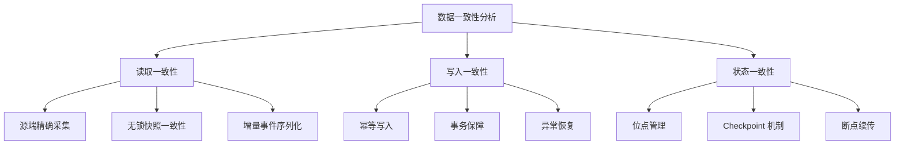
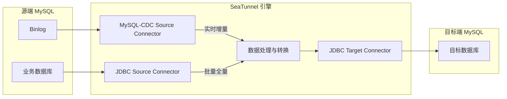
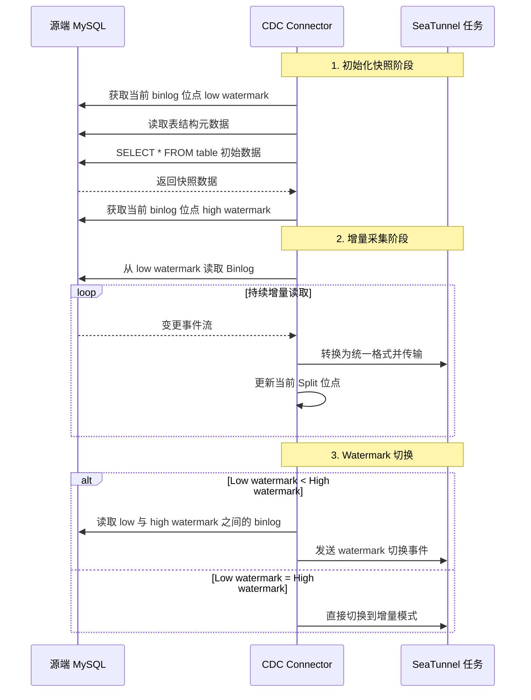
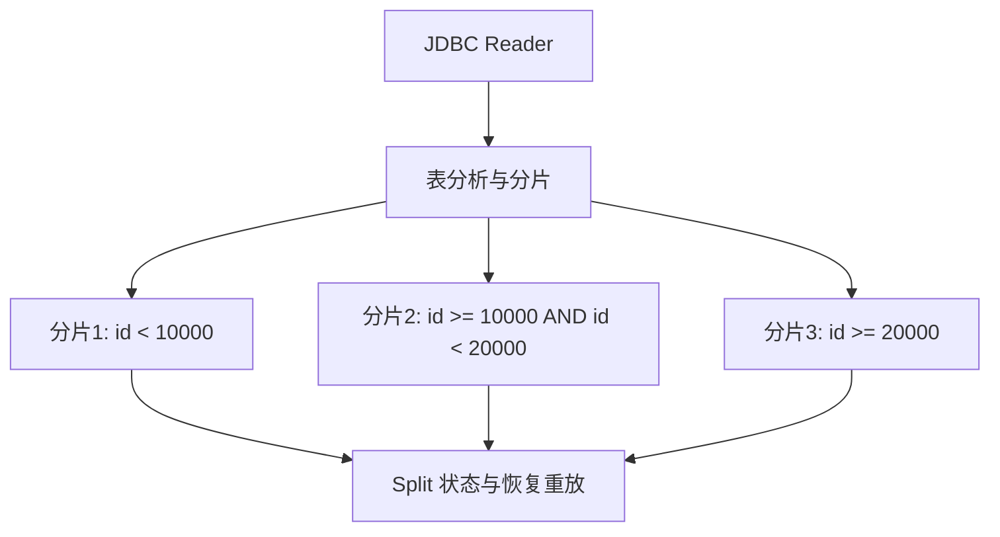
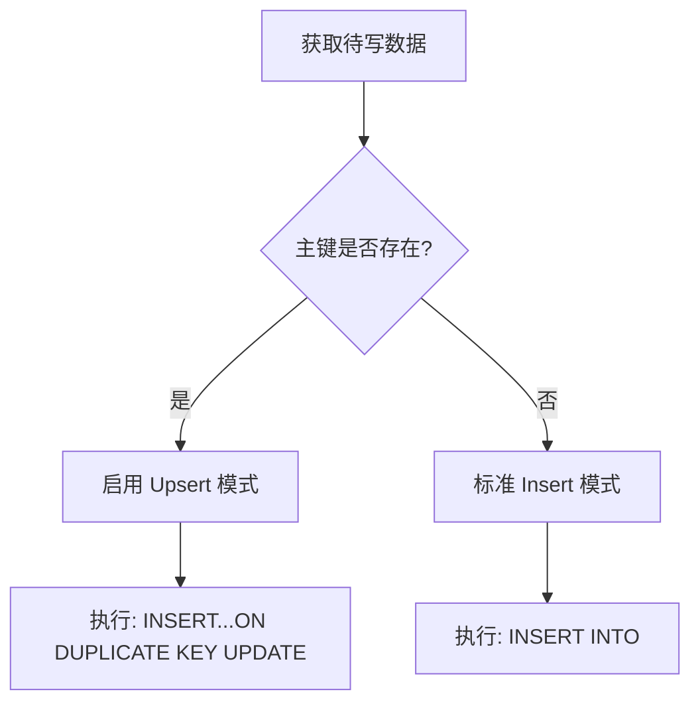
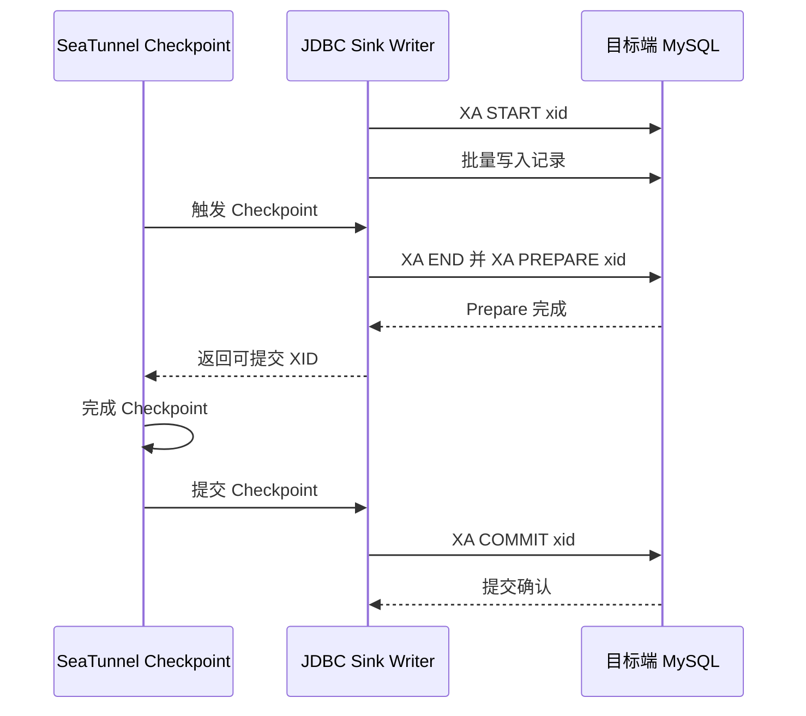
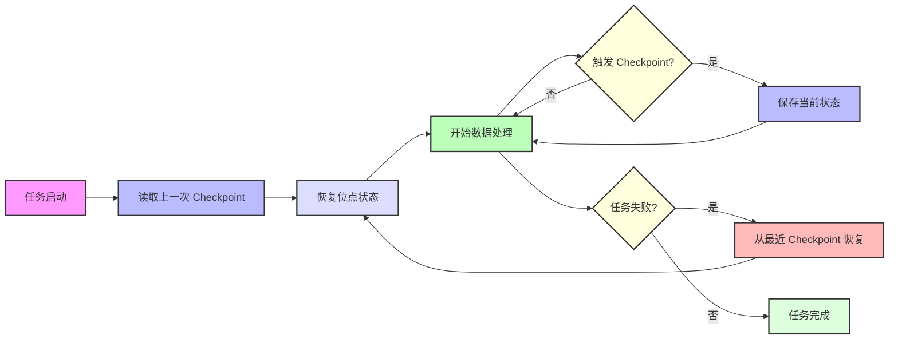
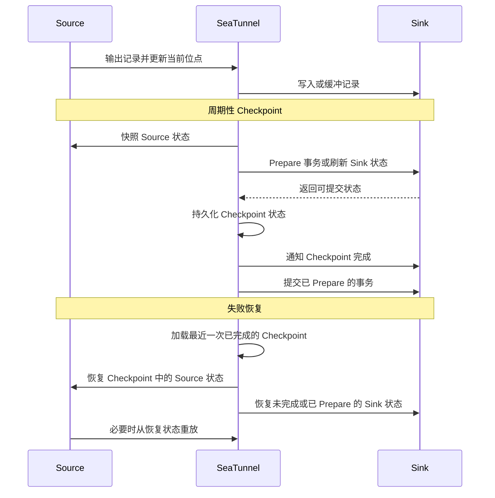

在企业级数据集成中，**数据一致性** 是技术决策者最关心的核心问题之一。但在这个看似简单的诉求背后，实际隐藏着复杂的技术挑战和架构设计。

当企业用户使用 SeaTunnel 进行 **批流数据同步** 时，通常会关注这些问题：

> 🔍 “如何确保源库和目标库之间的数据完整性？”  
> 🔄 “任务中断或恢复后，能否避免数据重复或丢失？”  
> ⚙️ “全量同步与增量同步过程中，如何保证一致性？”

本文以 **Apache SeaTunnel 2.3.13** 为配置基线，说明 **读取一致性、写入一致性和状态一致性** 如何协同工作。“零丢失”和“零重复”并非默认能力，而是有前提的结果：Source 和 Sink 语义必须兼容，Checkpoint 必须成功完成，还需要正确的主键或唯一键以及文档要求的 exactly-once 配置。

下文示例和术语以 2.3.13 版本的 [MySQL-CDC Source](https://seatunnel.apache.org/docs/2.3.13/connectors/source/MySQL-CDC/)、[JDBC Source](https://seatunnel.apache.org/docs/2.3.13/connectors/source/Jdbc/)、[JDBC Sink](https://seatunnel.apache.org/docs/2.3.13/connectors/sink/Jdbc/) 和 [Job Env 配置](https://seatunnel.apache.org/docs/2.3.13/introduction/configuration/JobEnvConfig/) 文档为准。

## 一、理解数据一致性的三个维度

在数据集成领域，“一致性”并不是一个单一概念，而是一组覆盖多个维度的保障。为了便于分析，本文将 SeaTunnel 的相关机制归纳为三个维度：



### 读取一致性

**读取一致性** 确保从源端系统获取的数据，在某个时间点或事件序列上保持逻辑完整性。这个维度解决的是“应该采集哪些数据”的问题：

- **全量读取**：在特定时间点获取完整的数据快照
- **增量采集**：准确记录所有数据变更事件（CDC 模式）
- **无锁快照一致性**：设置 `exactly_once = true` 时，通过 low watermark 和 high watermark 补齐快照期间发生的变更

### 写入一致性

**写入一致性** 确保数据能够可靠、正确地写入目标端系统，解决的是“如何安全写入”的问题：

- **幂等写入**：存在稳定主键/唯一键且启用 Upsert 语义时，同一个键被重放只会更新一条目标记录
- **事务完整性**：当 Sink 支持时，将单个 Sink Writer 处理的数据放入与 Checkpoint 对齐的事务中提交
- **错误处理**：从已完成的 Checkpoint 恢复，重放行为由 Source 和 Sink 语义共同决定

### 状态一致性

**状态一致性** 是连接读取端和写入端的桥梁，确保整个数据同步过程中的状态跟踪与恢复：

- **位点管理**：记录读取进度，用于精确增量同步
- **Checkpoint 机制**：周期性保存任务状态
- **Checkpoint 恢复**：从已完成的 Checkpoint 恢复；该 Checkpoint 之后的数据可能被重放，除非 Sink 具备幂等或事务型 exactly-once 能力

## 二、MySQL 同步架构：CDC 与 JDBC 模式对比

SeaTunnel 提供两种主流的 MySQL 数据同步模式：**JDBC 批模式** 和 **CDC 实时采集模式**。这两种模式适用于不同业务场景，并且在一致性保障上各有特点。



### CDC 模式：基于 Binlog 的低延迟变更采集

MySQL-CDC Connector 基于嵌入式 Debezium 框架实现，直接读取并解析 MySQL 的 binlog 变更流：

**核心优势**：

- **低延迟**：持续读取 binlog 变更，实际延迟取决于源端负载、网络和任务资源
- **减少轮询**：避免反复轮询业务表，但初始化快照仍会消耗源端资源
- **完整性**：完整捕获 INSERT/UPDATE/DELETE 事件
- **变更元数据**：输出携带 binlog 位点元数据的行级变更事件

**恢复与顺序特征**：

- 在 Checkpoint 中保存 binlog 文件名和位点，用于失败恢复
- 支持多种启动模式（初始化快照 + 增量 / 仅增量）
- 保持单个 Source Reader 观察到的事件顺序；端到端顺序仍受表路由、并行度和下游处理影响

MySQL-CDC 不会把一个源端事务转换成一个下游原子事务。Connector 输出的是独立的行级变更事件，最终交付语义由 Checkpoint 和 Sink 能力决定。

### JDBC 模式：基于 SQL 的批量同步方案

JDBC Connector 通过 SQL 查询从 MySQL 读取数据，适用于周期性全量同步或低频变更场景：

**核心优势**：

- **开发简单**：基于标准 SQL，配置灵活
- **全量同步**：适合大规模数据初始化
- **过滤能力**：支持复杂 WHERE 条件过滤
- **并行加载**：可基于主键或范围进行多分片并行读取

**恢复特征**：

- 跟踪 JDBC Split，而不是 Split 内部的行级 offset
- 失败后重新分配或重放未完成的 Split
- 支持表级并行处理

因此，JDBC Source 是 Split 级恢复。失败时，正在处理的 Split 可能从其边界重新读取，重复数据必须由幂等 Sink 或事务型 exactly-once Sink 处理。

## 三、读取一致性：如何确保源端数据完整采集

### CDC 模式：基于 Binlog 的精确增量读取

MySQL-CDC Connector 的读取一致性基于两个核心机制：**初始化快照** 和 **Binlog 位点跟踪**。



**启动模式与一致性保障**：

SeaTunnel 的 MySQL-CDC 提供多种启动模式，用于满足不同场景下的一致性要求：

1. **Initial Mode**：先创建全量快照，再继续读取增量 binlog。如果快照阶段必须补齐 low watermark 与 high watermark 之间的变更，需要设置 `exactly_once = true`。

   ```hocon
   MySQL-CDC {
     startup.mode = "initial"
     exactly_once = true
   }
   ```

2. **Latest Mode**：只采集 Connector 启动之后的最新变更

   ```hocon
   MySQL-CDC {
     startup.mode = "latest"
   }
   ```

3. **Specific Mode**：从指定 binlog 位点开始同步

   ```hocon
   MySQL-CDC {
     startup.mode = "specific"
     startup.specific-offset.file = "mysql-bin.000003"
     startup.specific-offset.pos = 4571
   }
   ```

此外还有 `earliest` 启动模式：从能够找到的最早 offset 开始。

### JDBC 模式：基于分片的高效批量读取

JDBC Connector 通过智能分片策略实现高效并行读取：



**分片策略与一致性**：

- **主键/唯一键分片**：存在受支持的键时，按该键拆分表
- **指定分片列**：自动发现的键不合适时，通过 `partition_column` 指定分片列
- **均匀或采样分片**：根据键分布和配置的阈值选择分片策略

SeaTunnel JDBC 读取分片示例配置：

```hocon
Jdbc {
  url = "jdbc:mysql://source_mysql:3306/test"
  driver = "com.mysql.cj.jdbc.Driver"
  user = "root"
  password = "password"
  table_path = "test.users"
  split.size = 10000
  split.even-distribution.factor.upper-bound = 100
  split.even-distribution.factor.lower-bound = 0.05
  split.sample-sharding.threshold = 1000
}
```

通过这种方式，SeaTunnel 可以实现：

- 并行处理相互独立的 Split
- 通过 Checkpoint 跟踪待处理的 Split 状态
- 恢复时从 Split 边界重放未完成的 Split

这不是行级断点续传。如果重放可能让同一行多次到达目标端，应使用具备稳定主键/唯一键的幂等 Upsert，或启用受支持的 exactly-once Sink。

## 四、写入一致性：如何确保目标端数据准确

在数据写入阶段，SeaTunnel 提供可配置机制，用于控制目标端 MySQL 的重放与事务行为。

### 幂等写入：确保数据不重复

SeaTunnel 的 JDBC Sink Connector 通过多种策略实现幂等写入：

**Upsert 模式**：



幂等写入示例配置：

```hocon
Jdbc {
  url = "jdbc:mysql://target_mysql:3306/test"
  driver = "com.mysql.cj.jdbc.Driver"
  user = "root"
  password = "password"
  generate_sink_sql = true
  database = "test"
  table = "users"
  primary_keys = ["id"]
  enable_upsert = true
}
```

**批量提交与优化**：

JDBC Sink 的批处理和重试行为由固定配置明确控制：

- **固定批大小**：`batch_size` 控制缓冲记录达到多少条时触发 Flush
- **Checkpoint 对齐 Flush**：Checkpoint 处理过程中也会刷新缓冲数据
- **显式重试次数**：`max_retries` 控制批执行重试，默认值为 `0`；启用 XA exactly-once 时必须保持为 `0`

### 分布式事务：XA 保障与两阶段提交

对于受支持的 Connector 路径，JDBC Sink 会将每个 Writer 的 XA 事务与 SeaTunnel Checkpoint 协调起来：



启用 XA 分布式事务的示例配置：

```hocon
Jdbc {
  url = "jdbc:mysql://target_mysql:3306/test"
  driver = "com.mysql.cj.jdbc.Driver"
  user = "root"
  password = "password"
  generate_sink_sql = true
  database = "test"
  table = "users"
  primary_keys = ["id"]
  enable_upsert = true
  max_retries = 0
  is_exactly_once = true
  xa_data_source_class_name = "com.mysql.cj.jdbc.MysqlXADataSource"
  max_commit_attempts = 3
}
```

**XA 事务作用范围**：

- 每个 Sink Writer 为一个 Checkpoint 准备自己的 XA 事务
- Checkpoint 完成后提交已 Prepare 的事务
- 恢复时，Connector 按协议处理该 Writer 未完成或已 Prepare 的事务

这为每个受支持的 JDBC Sink Writer 提供与 Checkpoint 对齐的 exactly-once 交付，但它**不会**将源端事务原样保留为一个下游事务，也不是跨多个表、Writer 或数据库的单一全局原子事务。跨系统业务原子性需要单独的事务设计。

## 五、状态一致性：断点续传与失败恢复

SeaTunnel 的状态一致性机制，是保障端到端数据同步可靠性的关键。通过精心设计的状态管理和 checkpoint 机制，SeaTunnel 具备可靠的失败恢复能力。

### 分布式 Checkpoint 机制

SeaTunnel 在分布式环境中实现状态一致性 checkpoint：



**核心实现原则**：

1. **位点记录**：CDC Source 记录 Split offset；JDBC Source 记录 Split 状态，但不记录正在处理的 Split 内部行级 offset
2. **Checkpoint 触发**：按照 `checkpoint.interval` 周期性调度 Checkpoint
3. **状态持久化**：将状态信息持久化到存储系统
4. **失败恢复**：恢复最近一次已完成的 Checkpoint；该 Checkpoint 之后的工作可能被重放

### 有前提的端到端交付语义

SeaTunnel 通过 Checkpoint 协调 Source 和 Sink 状态，最终交付语义取决于两端 Connector 及其配置：



使用 at-least-once Sink 时，重放可能产生重复写入。存在稳定主键/唯一键时，幂等 Upsert 可以吸收重复。JDBC XA exactly-once 还要求 `is_exactly_once = true`、兼容的 XA DataSource、`max_retries = 0`、已启用 Checkpoint 以及数据库端支持。

**Checkpoint 配置示例**：

```hocon
env {
  checkpoint.interval = 5000
  checkpoint.timeout = 60000
}
```

## 六、实战配置：MySQL CDC 到 MySQL 全量 + 增量同步

下面通过一个实战示例，展示如何配置 SeaTunnel 来实现可靠的 MySQL 到 MySQL 数据同步。

### 经典 CDC 模式配置

下面的 SeaTunnel 2.3.13 示例启用了 MySQL-CDC 快照一致性和与 Checkpoint 对齐的 JDBC XA 交付。其保障成立的前提包括：源端和目标端具有稳定主键、MySQL 驱动及服务端支持 XA、Checkpoint 存储可靠且 Checkpoint 成功完成。它不是跨两个目标表的全局事务。

```hocon
env {
  job.mode = "STREAMING"
  parallelism = 3
  checkpoint.interval = 60000
  checkpoint.timeout = 120000
}

source {
  MySQL-CDC {
    url = "jdbc:mysql://source_mysql:3306/test_db"
    username = "root"
    password = "password"
    database-names = [
      "test_db"
    ]
    table-names = [
      "test_db.mysqlcdc_to_mysql_table1",
      "test_db.mysqlcdc_to_mysql_table2"
    ]
    server-id = "5400-5408"

    # Initialization mode (full + incremental)
    startup.mode = "initial"
    exactly_once = true

    # Enable DDL changes
    schema-changes.enabled = true

    # Parallel read configuration
    snapshot.split.size = 8096
    snapshot.fetch.size = 1024
  }
}

transform {
  # Optional data transformation processing
}

sink {
  Jdbc {
    url = "jdbc:mysql://mysql_target:3306/test_db?useUnicode=true&characterEncoding=UTF-8&rewriteBatchedStatements=true"
    driver = "com.mysql.cj.jdbc.Driver"
    user = "root"
    password = "password"
    generate_sink_sql = true
    database = "${database_name}"
    table = "${table_name}"
    primary_keys = ["${primary_key}"]
    schema_save_mode = "CREATE_SCHEMA_WHEN_NOT_EXIST"
    data_save_mode = "APPEND_DATA"
    enable_upsert = true
    max_retries = 0
    is_exactly_once = true
    xa_data_source_class_name = "com.mysql.cj.jdbc.MysqlXADataSource"
  }
}
```

生产使用前，应确认每张路由表都能正确解析 `${primary_key}`，且目标表具有匹配的主键或唯一键。如果不具备这些前提，应将任务描述为 at-least-once，而不是零重复。

## 七、一致性校验与监控

任务上线后，必须使用独立方法验证一致性。应记录源端 binlog 位点等逻辑切面，等待目标端追平后比较固定快照，或者在停止写入的窗口内比较；直接比较持续变化的源端与存在延迟的目标端，既不能证明一致，也不能证明不一致。

### 数据一致性校验方法

1. **行数对比**：在同一一致性窗口内，按相同主键范围比较记录数

   ```sql
   -- Source database
   SELECT COUNT(*) FROM source_db.users;

   -- Target database
   SELECT COUNT(*) FROM target_db.users;
   ```

2. **确定性分段摘要**：按主键顺序读取有界范围内的规范化记录，由校验程序计算 SHA-256 等强摘要

   ```sql
   SELECT id, name, updated_at
   FROM users
   WHERE id >= ? AND id < ?
   ORDER BY id;
   ```

   哈希前必须为每个字段定义明确的 NULL 标记和无歧义的长度或转义规则，再逐段比较行数与摘要。不要使用 `SUM(CRC32(CONCAT_WS(...)))`：CRC32 碰撞和 NULL 处理都可能掩盖差异。

3. **按主键下钻**：某个范围存在差异时，按主键逐行比较。随机抽样适合定位问题，但不能证明全量一致。

### 一致性监控指标

SeaTunnel 任务执行过程中，应监控真实的 Connector 指标和 Checkpoint 信号：

- **`CDCRecordFetchDelay`**：CDC 记录抓取阶段观测到的延迟
- **`CDCRecordEmitDelay`**：CDC 记录输出阶段观测到的延迟
- **Checkpoint 状态**：引擎报告的完成、超时和失败信号
- **外部校验结果**：由独立校验任务或数据质量平台产生的行数、摘要和逐行差异

“写入成功率”和“数据偏差率”不是 SeaTunnel 内置的一致性证明。如果在外部监控系统中定义这些指标，必须明确时间窗口和分母。

## 八、最佳实践与性能优化

以下建议遵循 SeaTunnel 2.3.13 的 Connector 契约。上线前仍需使用具有代表性的数据量和故障场景完成基准与恢复验证。

### 一致性场景配置建议

1. **高可靠场景**（例如核心业务数据）：
   - 启用 MySQL-CDC `exactly_once` 和周期性 Checkpoint
   - 仅在驱动与数据库兼容时使用 JDBC XA，并保持 `max_retries = 0`
   - 配置稳定的目标端主键/唯一键与幂等 Upsert
   - 使用可靠的 Checkpoint 存储，并验证重启、超时和已 Prepare 事务恢复

2. **高性能场景**（例如分析类应用）：
   - 使用 CDC 模式 + 批量写入
   - 仅在可以接受 at-least-once 或幂等重放时关闭 XA
   - 增大 batch size
   - 优化并行度设置

3. **大规模初始化场景**：
   - 一个任务需要同时覆盖快照与增量时，优先使用 MySQL-CDC `initial` 模式
   - 仅在具备协调切换方案并能记录对应 binlog 位点时使用 JDBC 初始化
   - 配置合适的分片大小
   - 根据服务器资源调整并行度
   - 不要直接从 JDBC 切换到 CDC；未协调的切换可能产生数据缺口或重叠

### 常见问题与解决方案

1. **网络环境不稳定**：
   - 调整连接超时和任务级恢复配置
   - 启用 XA exactly-once 时保持 JDBC Sink `max_retries = 0`
   - 依赖已完成的 Checkpoint，并验证实际重放行为
   - 考虑使用更小的 batch size

2. **高并发写入场景**：
   - 根据目标数据库的连接和写入能力调整任务并行度
   - 测量锁与事务压力后，再考虑表分区或增大批次

3. **资源受限环境**：
   - 降低并行度
   - 仅在接受更大恢复/重放窗口后增加 Checkpoint 间隔
   - 优化 JVM 内存配置

## 九、结语：SeaTunnel 的一致性保障之路

SeaTunnel 为可靠的批流同步提供了必要机制，但最终保障属于完整任务配置和外部系统共同形成的结果。必须同时评估 Source 位点、已完成的 Checkpoint、幂等键以及 Sink 事务。

SeaTunnel 的一致性保障理念可以总结为：

1. **Source 恢复状态**：CDC 位点或 JDBC Split 状态决定从哪里恢复
2. **Checkpoint 协调**：已完成的 Checkpoint 对齐可恢复的 Source 与 Sink 状态
3. **明确的 Sink 语义**：幂等 Upsert 或受支持的 XA 决定如何处理重放
4. **独立校验**：基于一致性窗口的对账用于验证最终结果

满足这些前提时，SeaTunnel 可以在受支持的 Connector 路径上提供零丢失、零重复的交付语义。它不会自动提供跨表或跨数据库原子性，可达到的数据规模和延迟也必须通过具体工作负载验证。

---

> 如果你对 SeaTunnel 的数据一致性机制还有更多问题，欢迎加入社区交流。
